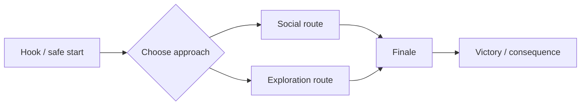

# Campaign Design and Quality Gates

## Campaign brief

Capture these decisions before implementation:

| Area | Decision |
|---|---|
| Identity | Name, slug, author/adaptor, source/provenance |
| Scope | One-shot/arc/campaign, session count, duration |
| Party | Size, level, pregens/user PCs, progression |
| Experience | Tone, pillars, difficulty, lethality, safety boundaries |
| Structure | Linear/branching/sandbox, map count, endings |
| Runtime | Manual/AI/LLM controllers, web requirements, assets |
| Constraints | Must-have scenes, excluded content, unsupported mechanics policy |

## Scene graph

For each scene, specify:

- player-visible purpose and entry condition;
- location/map and exits;
- NPCs and factions;
- clues, keys, state read/writes, and recovery clues;
- encounter objective, terrain, and noncombat options;
- rewards and consequences;
- completion and failure transitions;
- automation status: automated, LLM-assisted, or DM-run.

A useful map graph is explicit, for example:

## Dependency safety

For every required state transition, answer:

1. What sets the state?
2. What consumes it?
3. Is the target map/object loaded and addressable?
4. What if the check fails, NPC dies, item is lost, or LLM omits a phrase?
5. Can the DM inspect and repair the state?
6. Does save/load preserve the involved entities and flags?

Use at least two discoverable paths for mandatory information. A single check may provide an advantage, shortcut, or richer outcome, but should not strand the campaign.

## Encounter review

For each combat or hazard:

- state party assumptions and expected resources;
- use creatures/actions/spells that exist;
- check faction relationships and spawn positions;
- provide enough traversable space for token sizes;
- use cover, elevation proxies, light, terrain, hazards, or objectives intentionally;
- define surrender, retreat, bypass, reinforcement, and defeat behavior where relevant;
- test action availability for signature abilities;
- do not claim formal 5e encounter balance without doing the calculation and accounting for engine support.

## NPC review

Every important NPC should have:

- goal, fear, leverage, relationship, and immediate behavior;
- what they know, do not know, and may reveal;
- language and conversation availability;
- stable UID and faction;
- deterministic essential facts;
- response to hostility, bribery, failed checks, and scene progression;
- concise LLM backstory if enabled—facts and boundaries, not an unbounded novel.

## File integrity gate

- [ ] `game.yml`, `index.json`, README, and starting map exist.
- [ ] YAML and JSON parse.
- [ ] Campaign resource directories/files needed by loaders exist.
- [ ] Map registry, starting map, and webapp map agree.
- [ ] Map rows and layers are rectangular and aligned.
- [ ] Every layer token is built-in or defined in `legend`.
- [ ] Every coordinate and destination is in bounds.
- [ ] Every teleporter target is registered; intended return routes exist.
- [ ] NPC, character, spell, item, object, class, and race keys resolve.
- [ ] UIDs and state target names are unique/stable.
- [ ] Character count, selectable character entries, logins, controllers, and spawn slots agree.
- [ ] Referenced assets exist, or optional asset fields are omitted.

## Runtime gate

- [ ] `Session(root_path=campaign)` loads all maps.
- [ ] All pregens load and have expected actions/resources.
- [ ] Critical NPCs and objects resolve by UID.
- [ ] Start map is traversable and players spawn legally.
- [ ] Every transition works both technically and narratively.
- [ ] Critical interactions and state updates work.
- [ ] At least one representative combat reaches turns and exposes intended actions.
- [ ] Save/load round trip works after state mutation.
- [ ] Webapp starts and critical player/DM flow is browser-smoke-tested.

## Content and provenance gate

- [ ] Source, author/publisher, edition, and adapted scope are documented.
- [ ] No supplied source book/PDF or unauthorized artwork is committed.
- [ ] Descriptions and maps are newly written rather than copied substantially.
- [ ] Distribution rights are clear; otherwise README identifies private-use status and unresolved permissions.
- [ ] Original, SRD/public, and campaign-specific content are distinguishable.

## Completion gate

A campaign is complete only when the happy path is playable, critical failure paths recover, automated claims are verified, manual steps are explicit, validation errors are zero, and remaining warnings/limitations are documented.
