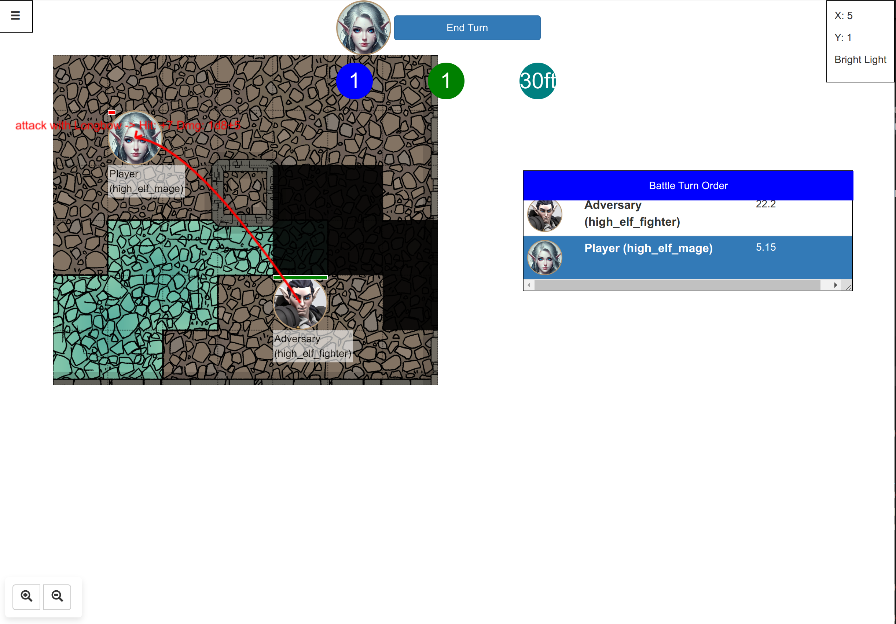

A Dungeons and Dragons game engine that can be used for AI related research

This project provides a complete Gymnasium compatible environment for performing
AI related research on the Dungeons and Dragons 5th edition RPGs. 

# Table of Contents

- [Project Title](#project-title)
- [Disclaimer](#disclaimer)
- [Features](#features)
- [Installation](#installation)
  - [Installing Gym](#installing-gym)
- [Quickstart](#quickstart)
- [Samples](#samples)
- [Environment and Setup](#environment-and-setup)
- [Dice Rolls](#dice-rolls)
  - [DieRoll Class Usage](#dieroll-class-usage)
    - [Basic Usage](#basic-usage)
    - [Extracting Individual Die Roll Details](#extracting-individual-die-roll-details)
- [Setting Up LLM Agents](#setting-up-llm-agents)
- [Running the interactive Webapp](#running-the-interactive-webapp)
- [Running Tests](#running-tests)
- [Observation and Action Spaces](#observation-and-action-spaces)
- [Environment Initialization Options](#environment-initialization-options)

Disclaimer
==========

Note that this library is meant as an independent research project for AI research. The developers and researchers in this project is in no way affiliate
  abilities that are outside the SRD and come from official published sources will be included in this library.

Features
========

- Simulation of DnD Maps, Line of Sight Computations, Cover
- Character classes (Fighter, Rogue, Cleric & Mage)
- Weapons and Spells systems
- Text-based interface with ability to be used as a backend for web based interfaces.
- Web-based VTT (virtual tabletop) interface for playing against agents.


Installation
============

This environment works with Gymnasium

Installing Gym
--------------

You can install the Gymnasium library using pip:

```
 
gymnasium
```

For development you may run the prequisite libraries using:

```
pip install -r requirements.txt
```

Quickstart
==========

Here is a simple example to get started with gym-dndenv. Below is an example demonstrates how to create the environment for testing battles against LLMs (e.g. GPT-4), reset it for the initial observation, and interact with it using a language model interfacer:


```python
from gymnasium import make
from llm_interface import GPT4Interfacer

MAX_EPISODES = 20

# Initialize the environment
env = make("dndenv-v0", root_path="templates", render_mode="ansi")
observation, info = env.reset(seed=42)

# Initialize your language model interfacer
prompt = GPT4Interfacer(debug=True)

# Select an action based on the initial state
action = prompt.select_action_for_state(observation, info)
print(f"Selected action: {action}")

terminal = False
episode = 0
while not terminal and episode < MAX_EPISODES:
    episode += 1
    observation, reward, terminal, truncated, info = env.step(action)
    if not terminal and not truncated:
        print(env.render())
        action = prompt.select_action_for_state(observation, info)
        print(f"Selected action: {action}")

    if terminal or truncated:
        print(f"Reward: {reward}")
        break
```

Samples
=======

Please see the samples directory for more samples. In particular, the notebook at samples/dnd_dqn.ipynb illustrates how to train an agent using Reinforcement Learning against a Rules-based AI (see generic_controller.py)

Environment and Setup
=====================

Building of maps and setting up of obstacles and walls can be done by editing the "game" .yml files. The number of possible customizations is extensive. The templates folder contains a directory that comprises the entire setup of the game
including npcs, races, the player character sheets, maps etc.

Dice Rolls
==========

Natural20.py comes with a complete Dungeons and Dragons die rolls simulator that you can use for other projects.

## DieRoll Class Usage

The `DieRoll` class provides a powerful and flexible way to handle dice rolls within tabletop RPGs and similar games. Below are examples on how to utilize this class effectively in your game sessions. It also parses the same die roll string format presented in DnD books and materials.

### Basic Usage

```python
from natural20.die_roll import DieRoll

# Rolling a single d20 die
result = DieRoll.roll('1d20').result()
print("Result of a d20 roll: ", result)
# Result of a d20 roll:  7

# Rolling two d6 dice with a +2 modifier
result = DieRoll.roll('2d6+2').result()
print("Result of 2d6 + 2: ", result)


# Rolling with advantage
advantage_roll = DieRoll.roll('1d20', advantage=True)
print("Roll with advantage: ", advantage_roll)
# Roll with advantage:  (5 | 15)

# Rolling with disadvantage
disadvantage_roll = DieRoll.roll('1d20', disadvantage=True)
print("Roll with disadvantage: ", disadvantage_roll)
# Roll with disadvantage:  (15 | 3)

# Critical hit dice rolls e.g. indicated Die are rolled twice
critical_roll = DieRoll.roll('1d6', crit=True)
print("Critical roll (double dice): ", critical_roll)
# Critical roll (double dice):  (5 + 1)

# Expected value of rolling 1d6 + 2
expected_value = DieRoll.roll('1d6+2').expected()
print("Expected value of 1d6 + 2: ", expected_value)
# Expected value of 1d6 + 2:  5.5

# Probability of rolling at least 10 on 1d20+5
probability = DieRoll.roll('1d20+5').prob(10)
print("Probability of rolling at least 10 on 1d20+5: ", round(probability, 2))
# Probability of rolling at least 10 on 1d20+5:  0.8
```

These also feature the fact that you are able to        self.assertEqual(self.entity.armor_class(), 12) extract the details of the individual die rolls
and not just the end result.

### Extracting Individual Die Roll Details
Get a die roll for 3d6: 


# Roll multiple dice
```python
print("Get a die roll for 3d6: ")
multi_die_roll = DieRoll.roll('3d6')

print("Final Result: ", multi_die_roll.result())
# Final Result:  7
```

# Access individual rolls
```python
individual_rolls = multi_die_roll.rolls
print("Individual rolls: ", individual_rolls)
# Individual rolls:  [1, 2, 4]
```

# Print each die roll from a complex roll with advantage
```python
complex_roll = DieRoll.roll('2d20', advantage=True)
for roll_pair in complex_roll.rolls:
    print("Roll pair: ", roll_pair, " -> Chosen roll: ", max(roll_pair))
# Roll pair:  (10, 11)  -> Chosen roll:  11
```

# Using detailed information to check for specific conditions
```python
contains_max = any(roll == complex_roll.die_sides for roll in complex_roll.rolls)
print("Contains a roll equal to max die side: ", contains_max)
# Contains a roll equal to max die side:  False
```

Setting Up LLM Agents
=====================

The following sample scripts illustrates how to setup LLM vs agent, ai fights:

samples/agent_vs_ai.py
samples/llm_vs_ai.py
samples/llm_vs_llm.py

There are also training scripts that uses LLMs instead of the built-in AI:

DQN_tests_gpt4o.py
DQN_tests_llama.py
DQN_tests_mistral.py

Note that it is recommended to use [VLLM](https://github.com/vllm-project/vllm) to host your local LLMs, OpenAIs gpt4o has better performance but at the cost of being more expensive to run. For OpenAI's gpt4 it goes without saying that you need a subscription to take advantage of API access.

The recommended route to run and setup VLLM is via Docker, below is a sample on how to get started with LLama 3:

```bash        self.assertEqual(self.entity.armor_class(), 12)
docker run --runtime=nvidia --gpus all -p 8000:8000 -v ~/.cache/huggingface:/root/.cache/huggingface \
       -it vllm --model NousResearch/Meta-Llama-3-8B-Instruct --dtype=auto --api-key token1234
```

Running the interactive Webapp
==============================

A built-in webapp can be used to interact and test the agent. It is a full featured VTT that allows you to play against various types of AI including Reinforcement Learning trained or rules based agents.

To run the webapp in gym mode, navigate to the project root

```
cd webapp
TEMPLATE_DIR=../samples/map_with_obstacles python -m flask run

```

By default this will open a port 5000 where you can view using the web browser at http://localhost:5000, clicking on this will allow you to login and view the battlemap.

For the list of usernames/passwords you may checkout the natural_20.py/samples/map_with_obstacles/index.json file



Running Tests
=============

```bash
python -m unittest discover tests
```

Run specific tests

```bash
python -m unittest tests.test_gym.TestGym.test_reset
python -m unittest tests.test_map.TestMap.test_line_of_sight
```
python -m unittest discover tests

Observation and Action Spaces
=============================

The `dndenv` environment provides a detailed observation space and a flexible action space to interact with the Dungeons and Dragons game.

### Observation Space

The observation space is a dictionary containing the following keys:

- `map`: A 3D array representing the game map with dimensions `(view_port_size[0], view_port_size[0], 5)`.
- `turn_info`: A 1D array of shape `(3,)` indicating the turn information.
- `conditions`: A 1D array of shape `(8,)` representing the conditions affecting the player.
- `player_ac`: A 1D array of shape `(1,)` representing the player's armor class.
- `player_equipped`: A 1D array of shape `(5,)` representing the items equipped by the player.
- `enemy_ac`: A 1D array of shape `(1,)` representing the enemy's armor class.
- `health_pct`: A 1D array of shape `(1,)` representing the player's health percentage.
- `health_enemy`: A 1D array of shape `(1,)` representing the enemy's health percentage.
- `enemy_reactions`: A 1D array of shape `(1,)` representing the enemy's reactions.
- `enemy_conditions`: A 1D array of shape `(8,)` representing the conditions affecting the enemy.
- `player_type`: A 1D array of shape `(1,)` representing the player's type.
- `enemy_type`: A 1D array of shape `(1,)` representing the enemy's type.
- `ability_info`: A 1D array of shape `(8,)` representing the player's ability information.
- `movement`: A 1D array of shape `(1,)` representing the player's movement.
- `spell_slots`: A 1D array of shape `(9,)` representing the player's spell slots.
- `is_reaction`: A 1D array of shape `(1,)` indicating if the current action is a reaction.

### Action Space

The action space is a tuple containing the following elements:

- `action_type`: A 1D array of shape `(1,)` representing the type of action to be performed.
- `target_position`: A 1D array of shape `(2,)` representing the target position for the action.
- `movement_vector`: A 1D array of shape `(2,)` representing the movement vector.
- `spell_index`: A discrete value representing the index of the spell to be cast.
- `item_index`: A discrete value representing the index of the item to be used.

Environment Initialization Options
==================================

The `dndenv` environment can be initialized with various options to customize the game setup:

- `view_port_size`: The size of the view port for the agent (default is 12x12).
- `max_rounds`: The maximum number of rounds before the game ends.
- `render_mode`: The mode to render the game in (e.g., 'ansi').
- `root_path`: The root path for the game.
- `map_file`: The file to load the map from.
- `profiles`: The profiles to load for the heroes.
- `enemies`: The profiles to load for the enemies.
- `hero_names`: The names of the heroes, can be a list or a lambda function.
- `enemy_names`: The names of the enemies.
- `show_logs`: Whether to show logs.
- `custom_controller`: A custom controller to use.
- `custom_agent`: A custom agent to use, can be a lambda function.
- `custom_initializer`: A custom initializer to use.
- `control_groups`: The control groups that the agent controls.
- `damage_based_reward`: Whether to use damage based rewards, -10 * (enemy final hp / enemy initial hp).
- `event_manager`: An event manager to handle game events.
- `custom_session`: A custom session to use.
- `reactions_callback`: A callback function for reactions.

