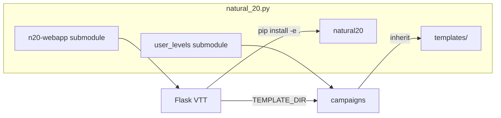

# Repository layout (submodules)

The engine checkout uses **git submodules** for the VTT and campaign content:

| Path | Remote | Role |
|------|--------|------|
| `n20-webapp/` | `git@github.com:jedld/n20-webapp.git` | Flask VTT, static assets, `tests/webapp/` |
| `user_levels/` | `git@github.com:jedld/n20-campaigns.git` | Campaign YAML, maps, assets (Git LFS for audio) |

The engine repo keeps `natural20/` and bundled SRD `templates/`.



## Clone

```bash
git clone --recurse-submodules git@github.com:jedld/natural_20.py.git
cd natural_20.py
git lfs install
git -C user_levels lfs pull
pip install -e .
pip install -e "./n20-webapp[dev]"
cd n20-webapp && npm install && cd ..
```

Existing clone:

```bash
git submodule update --init --recursive
git -C user_levels lfs pull
```

## Run

```bash
./start_web.sh wild_sheep_chase
# or
export N20_CAMPAIGNS_DIR="$(pwd)/user_levels"
./n20-webapp/start_web.sh wild_sheep_chase
```

Defaults to bundled `templates/` when no campaign argument is given.

## Environment variables

| Variable | Meaning |
|----------|---------|
| `TEMPLATE_DIR` | Absolute path or campaign slug (with `N20_CAMPAIGNS_DIR`) |
| `N20_CAMPAIGNS_DIR` | Base for campaign slugs; defaults to `./user_levels` in `start_web.sh` |
| `NATURAL20_TEMPLATES_ROOT` | Override engine SRD `templates/` path (rare) |

## Updating submodules

```bash
cd n20-webapp && git pull origin master && cd ..
cd user_levels && git pull origin master && git lfs pull && cd ..
git add n20-webapp user_levels
git commit -m "Bump webapp and campaigns submodules."
```

## Standalone repos

`n20-webapp` and `n20-campaigns` remain independent repositories. You can develop
in them directly and only bump the submodule pointers in the engine repo when releasing.

Bootstrap fresh standalone copies (optional):

```bash
./scripts/split_repositories/bootstrap.sh ~/workspace
```

## Engine ↔ webapp coupling

Five engine modules still lazy-import `webapp` (LLM providers, TTS, SocketIO). Install
both packages in the same virtualenv (`pip install -e .` + `pip install -e ./n20-webapp`).

| Engine module | Webapp import |
|---------------|---------------|
| `natural20/llm_controller.py` | `webapp.llm_handler` |
| `natural20/tts/campaign_voice_profiles.py` | `webapp.tts`, `webapp.llm_handler` |
| `natural20/spell/wall_of_fire_spell.py` | `runtime_state.get_socketio` |
| `natural20/item_library/speak_with_animals_scroll.py` | `get_conversation_service` |
| `natural20/image_gen/object_editor_icons.py` | `object_spawner_utils` |

## Packaging

```bash
pip install -e .   # natural20 engine + templates
```

See `pyproject.toml` and `MANIFEST.in`.
