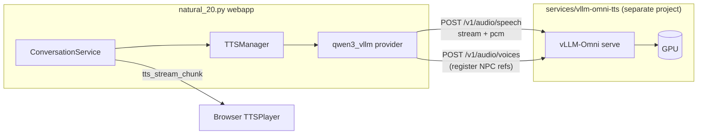

# vLLM-Omni TTS spike plan

Goal: run **Qwen3-TTS with true streaming** (~100 ms first audio packet) as a **separate GPU service**, while `natural_20.py` webapp stays a thin HTTP client — no `vllm-omni` in the main Python environment.

## Why separate?

| Concern | In-process `qwen3` (today) | Sidecar `vllm-omni` |
|---------|------------------------------|---------------------|
| Dependencies | `qwen-tts`, torch, flash-attn in webapp venv | Isolated venv / container |
| GPU ownership | Competes with Flask/gunicorn on same process | Dedicated inference worker |
| Streaming | Buffered WAV → fake chunking | Real PCM stream (`stream=true`) |
| Scale | 1 GPU, 1 worker | Can run on another host (`jedld-strix:8091`) |
| Deploy | Restart webapp to reload TTS | Rolling restart of TTS only |

The webapp already has stream delivery (`tts_stream_*` Socket.IO + `TTSPlayer`). A remote provider only needs to feed **real PCM chunks** into `TTSManager.generate_stream()`.

## Architecture



### Data flow (clone mode — Wild Sheep Chase)

1. **Bake** (existing): `scripts/bake_npc_voices.py` → `assets/voice_samples/<npc_uid>.wav` + `.ref.txt`
2. **Register** (new sidecar script): `services/vllm-omni-tts/scripts/register_campaign_voices.py` → `POST /v1/audio/voices` with `name=n20_<npc_uid>`
3. **Runtime**: webapp `create_voice()` stores `vllm_voice_name`; `generate_stream()` calls vLLM with `voice=n20_mara_bartender`, `stream=true`, `response_format=pcm`
4. **Replay**: concatenate streamed PCM → WAV in `N20_TTS_CACHE_DIR` (same as today)

**Accents:** the sidecar Base model clones the baked WAV/MP3 and **drops** YAML `voice.accent` / instruct at synthesis time. Bake English NPCs with **Qwen3 VoiceDesign** or **ElevenLabs Voice Design** (`--bake-provider elevenlabs`); CosyVoice 3 plus the bundled Chinese prompt WAVs produces unintelligible / Mandarin-like speech.

## Sidecar project layout

Self-contained under `services/vllm-omni-tts/` (not imported by webapp):

```
services/vllm-omni-tts/
  README.md              # install, start, healthcheck
  .env.example             # port, model, GPU, allowed paths
  start.sh                 # vllm serve wrapper
  docker-compose.yml       # optional GPU container
  scripts/
    healthcheck.sh         # curl /v1/audio/voices
    register_campaign_voices.py   # upload baked NPC WAVs
```

Start independently:

```bash
cd services/vllm-omni-tts
cp .env.example .env
./start.sh
```

Webapp connects via env only (no shared code):

```bash
# webapp/.env
TTS_PROVIDER=qwen3_vllm
VLLM_OMNI_TTS_URL=http://localhost:8091
VLLM_OMNI_TTS_MODEL=Qwen/Qwen3-TTS-12Hz-1.7B-Base
TTS_DELIVERY=stream
```

Remote host example (TTS on `jedld-strix`, webapp elsewhere):

```bash
VLLM_OMNI_TTS_URL=http://jedld-strix.local:8091
```

## vLLM-Omni API surface (spike scope)

Reference: [vLLM-Omni speech API](https://docs.vllm.ai/projects/vllm-omni/en/latest/serving/speech_api/)

### Server (Base clone model)

```bash
vllm serve Qwen/Qwen3-TTS-12Hz-1.7B-Base \
  --deploy-config vllm_omni/deploy/qwen3_tts.yaml \
  --omni --port 8091 --trust-remote-code --enforce-eager
```

`qwen3_tts.yaml` enables `async_chunk: true` (required for streaming TTFA).

### Register NPC voice (once per NPC)

```bash
curl -X POST http://localhost:8091/v1/audio/voices \
  -F "audio_sample=@mara_bartender.wav" \
  -F "consent=campaign_baked" \
  -F "name=n20_mara_bartender" \
  -F "ref_text=@mara_bartender.ref.txt"
```

Then synthesis uses `voice=n20_mara_bartender` without sending `ref_audio` each request.

**Alternative (no pre-register):** pass `ref_audio` as base64 data URL + `ref_text` per request — simpler spike, higher per-line overhead.

### Buffered synthesis

```json
POST /v1/audio/speech
{
  "model": "Qwen/Qwen3-TTS-12Hz-1.7B-Base",
  "task_type": "Base",
  "input": "Welcome to the tavern.",
  "voice": "n20_mara_bartender",
  "language": "English",
  "response_format": "wav"
}
```

### True streaming (spike success metric)

```json
POST /v1/audio/speech
{
  "input": "Welcome to the tavern.",
  "voice": "n20_mara_bartender",
  "language": "English",
  "response_format": "pcm",
  "stream": true,
  "stream_format": "audio"
}
```

Returns **raw 16-bit PCM, 24 kHz mono** chunks as they're decoded. Wire these into existing `tts_stream_chunk` events (`sample_rate=24000`).

Constraints from upstream:

- `speed` not supported when streaming
- `stream=true` requires `response_format=pcm`
- Model variant must match `task_type` (Base server for clone voices)

## Webapp integration

Provider: `webapp/tts/qwen3_vllm_provider.py` (`TTS_PROVIDER=qwen3_vllm`).

| Method | Behavior |
|--------|----------|
| `initialize()` | `GET /v1/audio/voices` healthcheck; no local GPU |
| `create_voice()` | Ensure voice registered (`POST /v1/audio/voices` if missing); store `vllm_voice_name` in `VoiceConfig.extra_metadata` |
| `generate()` | `POST /v1/audio/speech` → save WAV to cache |
| `generate_stream()` | `POST` with `stream=true` → yield `(24000, pcm_bytes)` |
| `persist_voice()` | Serialize `vllm_voice_name`, `ref_audio`, `ref_text` |
| `restore_voice()` | Re-register on load if server lost state |

Register in `TTSManager.PROVIDERS`:

```python
"qwen3_vllm": Qwen3VLLMProvider,
"mock_qwen3_vllm": MockQwen3VLLMProvider,  # tests
```

### Env vars

| Variable | Default | Purpose |
|----------|---------|---------|
| `VLLM_OMNI_TTS_URL` | `http://127.0.0.1:8091` | Sidecar base URL |
| `VLLM_OMNI_TTS_API_KEY` | `none` | `Authorization: Bearer` (if enabled) |
| `VLLM_OMNI_TTS_MODEL` | `Qwen/Qwen3-TTS-12Hz-1.7B-Base` | Must match server model |
| `VLLM_OMNI_TTS_VOICE_PREFIX` | `n20_` | Namespace uploaded NPC voices |
| `VLLM_OMNI_TTS_TIMEOUT` | `120` | HTTP timeout seconds |
| `VLLM_OMNI_TTS_REGISTER_ON_CREATE` | `1` | Auto-upload ref WAV on `create_voice` |
| `VLLM_OMNI_TTS_REGISTER_ON_START` | `1` | Bulk-register campaign `voice_samples/` on webapp bootstrap |
| `VLLM_OMNI_TTS_SOCKET_PCM` | auto | Live Socket.IO PCM; auto `1` when `TTS_DELIVERY=stream` + `qwen3_vllm` |

### HTTP client

Use `httpx` (already a transitive dep in many setups; add to `requirements.txt` if missing). Stream with `client.stream("POST", url, json=payload)` and read raw bytes.

No `qwen-tts` / `torch` / `flash-attn` in webapp when `TTS_PROVIDER=qwen3_vllm`.

### Sample rate note

vLLM-Omni Qwen3 outputs **24 kHz** PCM; in-process Qwen3 is often **12 Hz tokenizer → different rate**. `TTSPlayer` already accepts per-chunk `sample_rate` — verify replay WAV header uses 24000.

## Spike phases

### Phase 0 — Sidecar smoke test (no webapp changes)

**Owner:** ops / local GPU machine  
**Deliverables:**

- [ ] `services/vllm-omni-tts` starts and `scripts/healthcheck.sh` passes
- [ ] Manual `curl` WAV clone with Mara ref audio
- [ ] Manual `curl` PCM stream plays via `play -t raw -r 24000 -e signed -b 16 -c 1 -`
- [ ] Record TTFA (time to first byte) and full-line latency in `docs/TTS_VLLM_OMNI_SPIKE.md` results section

**Success:** first PCM byte &lt; 500 ms after request (target ~100–300 ms per Qwen benchmarks).

### Phase 1 — Voice registration bridge

**Deliverables:**

- [ ] `register_campaign_voices.py` uploads all `assets/voice_samples/*.wav` for a campaign
- [ ] Idempotent: skip if `GET /v1/audio/voices` already lists `n20_<uid>`
- [ ] Document re-run after campaign voice rebakes

### Phase 2 — Webapp HTTP provider (buffered)

**Deliverables:**

- [x] `Qwen3VLLMProvider.generate()` working with `TTS_PROVIDER=qwen3_vllm`
- [x] `scripts/benchmark_qwen3_tts.py --provider qwen3_vllm` parity
- [x] Unit tests with `mock_qwen3_vllm` (httpx mock)
- [x] Fallback: if sidecar down, log error + skip TTS (don't block conversation)

### Phase 3 — True streaming path

**Deliverables:**

- [x] `generate_stream()` forwards PCM to `ConversationService._stream_tts_audio`
- [x] `TTS_DELIVERY=stream` auto-plays chunks (`stream=true`, `response_format=pcm`)
- [x] Final WAV saved for replay (`_last_stream_output_path` + `tts_stream_end`)
- [x] Line cache still works (lookup before stream; WAV path after stream completes)

### Phase 4 — Production hardening (optional)

- [x] Docker Compose with GPU reservation
- [x] Voice pre-registration at campaign load (`VLLM_OMNI_TTS_REGISTER_ON_START` + `start_with_voices.sh`)
- [x] Auto-enable live PCM for `qwen3_vllm` when `TTS_DELIVERY=stream`
- [ ] Separate TTS GPU host in ngrok/tmux docs
- [ ] Compare 0.6B vs 1.7B on same hardware

## Coexistence with in-process Qwen3

| Use case | Provider |
|----------|----------|
| Dev laptop, no vLLM setup | `qwen3` (in-process) |
| Production / low latency | `qwen3_vllm` (sidecar) |
| CI tests | `mock_qwen3_vllm` |

Campaign assets (`voice_samples/`, `voice_profiles/`) are **shared**; only the synthesis backend changes.

## Automatic voice registration (runtime)

When the webapp TTS provider is `qwen3_vllm`, the [`Qwen3VLLMProvider`](n20-webapp/webapp/tts/qwen3_vllm_provider.py)
handles voice registration to the remote vLLM-Omni sidecar automatically:

1. **Startup batch registration**: `register_campaign_voices_if_needed()` uploads all
   `assets/voice_samples/*.{wav,mp3}` from the current campaign to the sidecar at app bootstrap.
   Replaced clips (mtime/size vs `<uid>.profile.json`) are re-uploaded even if the voice name
   already exists.

2. **Lazy per-NPC registration**: When `create_voice()` is called for an NPC whose voice
   is not yet on the remote server, `_ensure_registered()` performs broad discovery:
   - Explicit `reference_audio` path from YAML
   - Campaign `assets/voice_samples/<npc_uid>.wav` or `.mp3` (baked or dropped sample)
   - Campaign `assets/voice_samples/type_<npc_type>.wav` or `.mp3` (type-level fallback)
   - Bundled `templates/voice_samples/<npc_uid>.wav` or `.mp3`

   If the YAML voice profile (prompt/accent/traits) or the sample file changed since the last
   stamp, the sidecar clone is re-registered. VoiceDesign-baked WAVs are also regenerated.

3. **Graceful fallback**: If no reference audio can be found, a warning is logged and the
   voice name is added to the local `_server_voices` cache so we don't keep retrying.
   The NPC conversation will still emit text — TTS simply won't produce audio for that NPC
   until a voice sample is baked (`scripts/bake_npc_voices.py`) or manually registered
   (`services/vllm-omni-tts/scripts/register_campaign_voices.py`).

4. **Automatic sample rate resampling**: Reference WAV/MP3 files are automatically converted
   to a WAV matching the Qwen3-TTS target sample rate (24 kHz default) before upload. This prevents
   audio corruption when voice samples are recorded at 16 kHz (a common sample rate for
   voice memos) or dropped as MP3. Resampled files are cached under `<cache_dir>/resampled/`
   with the source mtime in the filename so replacing a clip invalidates the cache. Requires `scipy`
   and `numpy` (already in `requirements.txt`); MP3 decode uses `ffmpeg` (or pydub). When
   unavailable, the original file is uploaded with a logged warning.

### Troubleshooting: "Voice 'n20_xxx' is not registered on vLLM-Omni"

```
[TTS] Voice 'n20_pia_bernal' is not registered on vLLM-Omni and no
reference_audio is available to upload for NPC pia_bernal.
```

**Fix options (pick one):**

1. **Bake the voice locally** (requires local Qwen3 model):
   ```bash
   N20_TTS_BAKE_VOICES=1 python scripts/generate_voice_profiles.py user_levels/wild_sheep_chase
   ```

2. **Upload manually** from an existing WAV:
   ```bash
   cp my_voice.wav user_levels/wild_sheep_chase/assets/voice_samples/pia_bernal.wav
   cd services/vllm-omni-tts && ./scripts/register_campaign_voices.py ../../user_levels/wild_sheep_chase
   ```

3. **Reregister all campaign voices on restart**:
   ```bash
   VLLM_OMNI_TTS_REGISTER_ON_START=1 ./start_web.sh user_levels/wild_sheep_chase
   ```

### Troubleshooting: "Audio sounds corrupted or has weird background noise"

If the voice is correct but the synthesized speech sounds garbled, muffled, or has
strange background artifacts, the most likely cause is a **sample rate mismatch** between
the reference WAV and the Qwen3-TTS model output:

- Qwen3-TTS outputs at **24 kHz** by default.
- Many voice recordings (phone memos, dictation apps) are **16 kHz** or **22.05 kHz**.
- Uploading a 16 kHz reference to vLLM-Omni while the model synthesizes at 24 kHz causes
 the cloned voice to sound corrupted.

**Fix:** The webapp now automatically resamples reference WAVs to 24 kHz during voice
registration (both at startup and at runtime). Ensure `scipy` and `numpy` are installed:

```bash
pip install scipy numpy
```

To verify the sample rate of a voice file:
```bash
ffprobe -v error -show_entries stream=sample_rate -of default=noprint_wrappers=1 path/to/voice.wav
```

If the issue persists after enabling resampling, restart the webapp to trigger a fresh
voice registration with the resampled reference.

### Troubleshooting: "requires 'ref_audio' for voice cloning"

```
Base task with built-in speaker 'n20_npc_lenka_ash' requires 'ref_audio' for voice cloning
POST /v1/audio/speech 400 Bad Request
```

The sidecar is treating the NPC name as a **built-in speaker** instead of an uploaded
ICL clone voice. That happens when the webapp sends `voice=n20_<uid>` without having
uploaded `assets/voice_samples/<uid>.wav` (or without attaching `ref_audio` on the
speech request). Death House NPCs often have YAML `provider: qwen3`; that tag now
stays on the running `qwen3_vllm` sidecar instead of spinning a second in-process
engine that never registers the clone sample.

**Fix options:**

1. Confirm the baked WAV exists: `user_levels/<campaign>/assets/voice_samples/<entity_uid>.wav`
   (Lenka is `npc_lenka_ash.wav`, not `lenka_ash.wav`).
2. Restart the webapp so startup registration uploads new samples
   (`VLLM_OMNI_TTS_REGISTER_ON_START=1`).
3. Upload immediately:
   ```bash
   python services/vllm-omni-tts/scripts/register_campaign_voices.py user_levels/death_house
   ```
4. If the WAV is missing, bake it first:
   ```bash
   N20_TTS_BAKE_VOICES=1 python scripts/bake_npc_voices.py user_levels/death_house
   ```

A successful clone request logs `Auto-set ref_audio for uploaded voice: n20_<uid> (icl=True)`.

## Risks and mitigations

| Risk | Mitigation |
|------|------------|
| vLLM-Omni API drift | Pin version in sidecar `requirements.txt`; integration tests against `/v1/audio/voices` |
| Server restart drops uploaded voices | Re-run `register_campaign_voices.py` on sidecar start (systemd `ExecStartPost`) |
| Missing reference audio for new NPC | Auto-discovery searches 4 locations; graceful fallback logs warning without crashing |
| 24 kHz vs 22.05 kHz client assumptions | Pass `sample_rate` on every stream chunk |
| GPU memory with LLM + TTS on same box | Run sidecar on dedicated GPU (`CUDA_VISIBLE_DEVICES`) |
| Network latency remote TTS | Prefer LAN; benchmark `jedld-strix.local:8091` RTT |

## Benchmark checklist (fill in during spike)

Measured 2026-07-29 on RTX 3090, `mara_bartender`, clone mode, campaign `wild_sheep_chase`.
Sidecar already running (`services/vllm-omni-tts/start.sh`); in-process uses `QWEN3_USE_FLASH_ATTN=0` (flash-attn not installed in n20-tts env).

| Metric | In-process `qwen3` clone | vLLM-Omni stream |
|--------|------------------------|------------------|
| Process init | **19.2 s** (model load + 2.7 s warmup) | **0.07 s** (HTTP healthcheck; sidecar already up) |
| TTFA (first PCM byte) | **6.26 s** (fake stream — full WAV first) | **0.76 s** (true PCM stream) |
| Full line (~5 s audio, cold) | **6.54 s** buffered | **1.66 s** buffered / **1.88 s** stream total |
| RTF | **1.19–1.20** (slower than realtime) | **0.33** (3× faster than realtime) |
| Line cache hit | **&lt;10 ms** | **&lt;10 ms** (webapp-side) |
| First sidecar request (cold HTTP) | — | **~11 s** one-time after sidecar boot (subsequent ~1.7 s) |

Use:

```bash
# in-process baseline
cd webapp && python ../scripts/benchmark_qwen3_tts.py ../user_levels/wild_sheep_chase

# sidecar (after Phase 2)
cd webapp && python ../scripts/benchmark_qwen3_tts.py ../user_levels/wild_sheep_chase --provider qwen3_vllm
```

## References

- [vLLM-Omni speech API](https://docs.vllm.ai/projects/vllm-omni/en/latest/serving/speech_api/)
- [Qwen3-TTS online serving example](https://docs.vllm.ai/projects/vllm-omni/en/stable/user_guide/examples/online_serving/qwen3_tts/)
- [Qwen3-TTS performance guide](https://qwenlm-qwen3-tts.mintlify.app/advanced/performance)
- Repo: `services/vllm-omni-tts/README.md`
- Repo: `docs/TTS_PROVIDERS.md`, `docs/TTS_DELIVERY.md`
