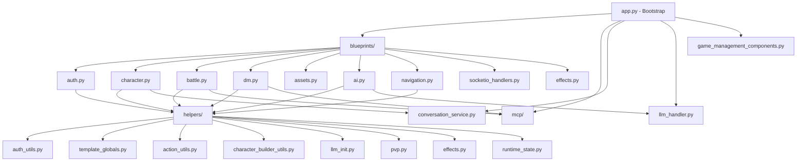

# webapp/app.py Refactor Plan

## Executive Summary

This plan refactors `webapp/app.py` from a monolith into domain blueprints and helper modules **without changing API paths or runtime behavior**. The implementation should be done incrementally with a strict safety net: route parity checks, phased extraction, and targeted regression tests after each move.

### Success Criteria (Definition of Done)

- All existing HTTP routes and SocketIO events remain available with identical behavior.
- Existing tests pass, and new extraction-focused tests are added for each moved domain.
- `webapp/app.py` becomes a thin composition module (bootstrap + registration).
- Imports are acyclic across blueprints/helpers.
- A rollback point exists after every phase.

## Problem Statement

`webapp/app.py` is **8,067 lines** with **127 route/socket endpoints** and dozens of helper functions crammed into a single module. This makes the file hard to navigate, test, and extend. The goal is to split it into Flask blueprints organized by domain, while preserving backward compatibility and building test coverage for every extracted piece.

## Non-Goals (Guardrails)

- Do not change endpoint URLs, HTTP methods, payload schemas, or response shapes.
- Do not introduce a full Flask app factory conversion in this effort.
- Do not redesign auth/session semantics.
- Do not fold MCP tool behavior into this refactor (only relocate wiring if needed).

## Current Responsibility Groups (by line range)

| Domain | Approx. Lines | Endpoints | Key Helpers |
|---|---|---|---|
| **App bootstrap** | 1-470 | - | Flask app factory, CORS, SocketIO, config, caches, compression, static max-age |
| **Effects & event listeners** | 470-833 | `socketio.on('connect')`, `socketio.on('request_effects')` | `_emit_narration_overlay`, `_emit_control_override_change`, `_on_turn_skipped`, `_select_outcome_narration`, `_on_battle_end_narrate`, effect filter helpers |
| **LLM initialization** | 833-1100 | - | `register_game_context_functions()`, `configure_llm_handler_from_environment()`, `initialize_llm_from_env()`, MCP bridge |
| **Auth & session** | 1100-1120 | - | `logged_in()`, `roles_for_username()`, `user_role()` |
| **PvP & character spawning** | 1120-1520 | - | `selectable_character_entry()`, `pvp_team_config()`, `ensure_character_entity_loaded()`, `assign_character_team_and_spawn()`, `spawn_deferred_entity()`, `pvp_autofill_candidates()`, `autofill_pvp_battle_turn_order()` |
| **Template globals** | 1520-2088 | - | `controller_of()`, `can_rest_for()`, `within_talking_distance()`, `t()`, `opacity_for()`, `transform_for()`, `filter_for()`, `entities_controlled_by()`, `interact_flavors()`, `action_flavors()`, `ability_mod_str()`, `casting_time()`, `format_game_time()`, `entity_owners()`, `visible_log_messages_for_username()`, `describe_terrain()` |
| **Admin (save/load/effect/perf)** | 1543-1863, 4515-4555, 7676-7720 | `/admin/saves`, `/admin/save`, `/admin/load`, `/admin/manage_saves`, `/admin/effect`, `/admin/perf`, `/admin/perf/reset`, `/admin/campaign-logs/reset`, `/admin/campaign-logs/status` | - |
| **Assets serving** | 2106-2165 | `/assets/maps/*`, `/assets/sounds/*`, `/assets/objects/*`, `/assets/editor/*`, `/assets/items/*`, `/assets/*` | - |
| **Map editor** | 2167-2455 | `/create_map`, `/upload_map_background`, `/delete_map` | - |
| **Character builder** | 2456-3737 | `/character_builder/prebuilt_images`, `/character_builder/items`, `/character_builder`, `/character_builder/import_dndbeyond`, `/character_editor/*`, `/update_character/*`, `/create_character`, `/character_details/*` | `_parse_json_list_form()`, `_parse_json_dict_form()`, `_ability_mod()`, `_spell_choice_caps()`, `_apply_class_and_feat_choices()`, `_resolve_character_yaml_path()`, `_can_edit_character()`, `_make_circular_token()`, `_decode_data_url_image()`, `_resolve_prebuilt_character_image()`, `_save_character_images()`, `_load_character_image_from_request()`, `_register_new_character_in_campaign()` |
| **Login/selection** | 3065-3615 | `/login`, `/character_selection`, `/select_character` | - |
| **Journal** | 3738-3950 | `/character/*/journal` (GET, POST, DELETE) | `_journal_owner_check()`, `_serialize_journal()`, `_persist_journal_change()`, `_log_journal_entry_to_campaign_db()`, `_record_narration_for_pcs()` |
| **Index & navigation** | 3972-4192 | `/`, `/command`, `/reload_map`, `/response`, `/focus`, `/switch_map` | `pov_entities()`, `render_pov_entities()` |
| **Pathfinding** | 4209-4409 | `/path`, `/path/cost_map`, `/jump_info` | - |
| **Performance tracking** | 4436-4514 | - | `_perf_should_track()`, `_perf_start_timer()`, `_perf_stop_timer()`, `_perf_socketio_emit()` |
| **SocketIO handlers** | 4556-4607 | `socketio.on('register')`, `socketio.on('message')`, `socketio.on('disconnect')` | - |
| **Battle core** | 4623-4730 | `/start`, `/stop`, `/battle`, `/end_turn`, `/turn_order`, `/next_turn` | `continue_game()` |
| **DM entity management** | 4731-5184 | `/reorder_initiative`, `/available_npcs`, `/available_objects`, `/spawn_npc`, `/spawn_object`, `/delete_entity`, `/move_entity`, `/available_pcs`, `/update_npc` | - |
| **Map state** | 5185-5246 | `/update`, `/mark_note_read` | - |
| **Actions** | 5247-6260 | `/actions`, `/hide`, `/target`, `/spells`, `/reaction` (GET, POST), `/manual_roll`, `/switch_pov`, `/read_letter`, `/action`, `/ready_action`, `/items`, `/info`, `/entity_info`, `/reset_narrations`, `/targets_at_position` | `action_type_to_class()`, `resolve_requested_action_type()`, `validate_targets()`, `process_action_hash()` |
| **Combat log** | 4193-4208 | `/api/combat-log`, `/combat-log` | - |
| **Auth** | 6270-6274 | `/logout` | - |
| **Turn & time** | 6275-6292 | `/turn`, `/game_time` | - |
| **DM mutations** | 6293-7401 | `/update_npc_default_controller`, `/add`, `/remove_from_battle`, `/tracks`, `/sound`, `/volume`, `/seek`, `/unequip`, `/equip`, `/dm/items_catalog`, `/dm/inventory` (GET, POST add, POST remove), `/dm/container/*`, `/equipment`, `/usable_items`, `/update_group`, `/update_controller`, `/update_hp`, `/update_action_resources`, `/update_spell_slots`, `/rest/preview`, `/rest`, `/dm_move_entity`, `/get_users` | `_dm_resolve_entity()`, `_can_act_for_entity()`, `_wizard_arcane_recovery_state()`, `_entity_rest_snapshot()` |
| **AI/LLM** | 7489-7923 | `/ai/initialize`, `/ai/initialize-from-env`, `/ai/chat`, `/ai/context`, `/ai/clear-history`, `/ai/history`, `/ai/ollama/models`, `/ai/llama_cpp/models`, `/ai/set-model`, `/ai/provider-info`, `/ai/entity-details`, `/ai/terrain-info`, `/ai/available-actions` | `_restore_dm_ai_history_from_session()`, `_persist_dm_ai_history_to_session()`, `_log_dm_assistant_turn()`, `get_game_context()` |
| **Login guard** | 4411-4433 | `before_request(require_login)` | - |

## Dependency Boundaries (Must Preserve)

- `webapp/blueprints/*` may import:
  - `natural20/*`
  - `webapp/blueprints/helpers/*`
  - selected shared modules already used in production (`conversation_service`, `llm_handler`, `game_management_components`, etc.)
- `webapp/blueprints/helpers/*` should stay mostly pure and avoid importing blueprint modules.
- `webapp/app.py` remains the composition root for:
  - global objects (`app`, `socketio`, `current_game`, `game_session`, caches)
  - blueprint registration
  - cross-cutting middleware/hooks (login guard, template globals wiring, compression/cors)

These boundaries reduce circular import risk and keep extraction mechanical.

## Proposed Blueprint Architecture

```
webapp/
  app.py                          # Slim bootstrap (~300 lines): create_app(), register blueprints, SocketIO, global state
  blueprints/
    __init__.py
    auth.py                       # /login, /logout, /character_selection, /select_character
    character.py                  # /character_builder/*, /character_editor/*, /create_character, /update_character/*, /character_details/*, /character/*/journal
    battle.py                     # /start, /stop, /battle, /end_turn, /turn_order, /next_turn, /reorder_initiative, /action, /ready_action, /actions, /target, /spells, /reaction, /items, /switch_pov, /read_letter, /manual_roll, /hide, /turn, /game_time, /combat-log, /api/combat-log, /info, /entity_info, /reset_narrations, /targets_at_position
    dm.py                         # /admin/*, /dm/*, /spawn_npc, /spawn_object, /delete_entity, /move_entity, /dm_move_entity, /available_npcs, /available_objects, /available_pcs, /update_npc, /update_group, /update_controller, /update_hp, /update_action_resources, /update_spell_slots, /rest/*, /equip, /unequip, /equipment, /usable_items, /add, /remove_from_battle, /tracks, /sound, /volume, /seek, /get_users
    assets.py                     # /assets/*, /create_map, /upload_map_background, /delete_map
    ai.py                         # /ai/*
    navigation.py                 # /, /command, /reload_map, /response, /focus, /switch_map, /path, /path/cost_map, /jump_info, /refresh-portraits, /update, /mark_note_read
    socketio_handlers.py          # socketio.on('connect'), 'register', 'message', 'disconnect', 'request_effects'
    effects.py                    # Effect filter helpers, event listeners for narration/control_override/turn_skipped
    helpers/
      __init__.py
      template_globals.py         # controller_of, can_rest_for, within_talking_distance, t, opacity_for, transform_for, filter_for, action_flavors, ability_mod_str, casting_time, format_game_time, entity_owners, visible_log_messages_for_username, describe_terrain, entities_controlled_by, interact_flavors
      character_builder_utils.py  # _parse_json_list_form, _ability_mod, _spell_choice_caps, _apply_class_and_feat_choices, image helpers
      action_utils.py             # action_type_to_class, resolve_requested_action_type, validate_targets, process_action_hash
      llm_init.py                 # register_game_context_functions, configure_llm_handler_from_environment, initialize_llm_from_env, MCP bridge
      pvp.py                      # PvP autofill, team config, character spawning helpers
      auth_utils.py               # logged_in, roles_for_username, user_role
      runtime_state.py            # accessors for app globals used across blueprints
```

### Optional Internal Package Split for Very Large Blueprints

If `battle.py` or `dm.py` exceeds ~1200 lines during extraction, split those into package modules while preserving one public blueprint symbol:

```
blueprints/
  battle/
    __init__.py      # exposes battle_bp and imports routes submodules
    routes_core.py
    routes_actions.py
    routes_reactions.py
  dm/
    __init__.py      # exposes dm_bp and imports routes submodules
    routes_admin.py
    routes_inventory.py
    routes_entities.py
```

This keeps diffs reviewable and avoids creating a new mini-monolith.

### Key Design Decisions

1. **No `create_app()` factory yet** - The current code uses module-level globals (`current_game`, `game_session`, `socketio`, `llm_handler`) that are initialized at import time. Introducing a factory pattern is a separate, larger refactor. For now, blueprints import state access via `helpers/runtime_state.py`.

2. **Blueprint URL prefixes** - Most blueprints will use URL prefixes to keep routes short inside the module:
   - `auth_bp` - no prefix (routes are top-level: `/login`, `/logout`)
   - `character_bp` - no prefix (mixed: `/character_builder`, `/character/*`)
   - `battle_bp` - no prefix (mixed: `/action`, `/start`, `/turn`)
   - `dm_bp` - no prefix (mixed: `/dm/*`, `/admin/*`, `/spawn_*`)
   - `assets_bp` - prefix `/assets`
   - `ai_bp` - prefix `/ai`
   - `navigation_bp` - no prefix

3. **SocketIO handlers stay in one module** - SocketIO events do not use Flask blueprints. Extract them to `socketio_handlers.py` for readability but keep them registered on the global `socketio` object.

4. **Helpers in dedicated submodules** - Pure utility functions (no route decorators) go into `helpers/` so blueprints can import them without circular dependencies.

5. **Preserve URL compatibility** - Every existing URL must continue to work. Blueprint registration uses the same URL paths.

6. **Keep endpoint names stable when feasible** - If route function names are externally referenced (`url_for`), preserve endpoint names explicitly via `endpoint=` when moving handlers.

7. **Explicit registration ordering** - Keep startup registration order deterministic (middleware/hooks, helpers, blueprints, socket handlers) to avoid hidden import-order side effects.

## Migration Strategy (Incremental, Test-First)

### Phase 0: Baseline Inventory and Safety Net

1. Produce a machine-generated route inventory before changes:
   - URL rule
   - methods
   - endpoint name
2. Capture SocketIO event names and current handler mapping.
3. Save baseline outputs into `plans/artifacts/` for parity checks.
4. Run baseline tests once and record timing/failure snapshot.

### Phase 1: Foundation (Low-Risk Extractions)

1. **Create `webapp/blueprints/__init__.py`** and `webapp/blueprints/helpers/__init__.py`
2. **Extract helper modules first** (no routes, pure functions):
   - `helpers/auth_utils.py` - `logged_in()`, `roles_for_username()`, `user_role()`
   - `helpers/template_globals.py` - all `app.add_template_global()` functions
   - `helpers/action_utils.py` - `action_type_to_class()`, `resolve_requested_action_type()`, etc.
   - `helpers/character_builder_utils.py` - character creation helpers
   - `helpers/llm_init.py` - LLM handler initialization
   - `helpers/pvp.py` - PvP autofill logic
   - `helpers/effects.py` - effect filter functions
   - `helpers/runtime_state.py` - read accessors for current app globals
3. **Write tests for each helper module** before touching `app.py`
4. **Update `app.py` to import from helpers** (no behavior change)
5. **Add route parity test utility** that asserts route inventory matches baseline.

### Phase 2: Extract Blueprints (One Domain at a Time)

For each blueprint:
1. Create the blueprint file with all routes copied from `app.py`
2. Write smoke tests for every endpoint
3. Register the blueprint in `app.py`
4. Remove the routes from `app.py`
5. Run targeted tests + route parity check
6. If green, run broader suite gate
7. Commit checkpoint for easy rollback

Order of extraction (smallest to largest risk):
1. **assets** - 6 routes, simple file serving, easy to test
2. **auth** - 4 routes (`/login`, `/logout`, `/character_selection`, `/select_character`)
3. **ai** - 13 routes, mostly pass-through to `llm_handler`
4. **navigation** - 10 routes, map/path navigation
5. **character** - 10 routes, character builder + journal
6. **battle** - 20+ routes, core game loop (highest risk, last)
7. **dm** - 30+ routes, highest mutation surface (same risk class as battle)

### Phase 3: SocketIO & Effects Extraction

8. **socketio_handlers.py** - Move all `@socketio.on()` handlers
9. **effects.py** - Move effect helpers and event listeners

### Phase 4: Cleanup

10. **Slim `app.py`** to ~300 lines: imports, Flask app creation, global state, blueprint registration, `__main__` block
11. **Update AGENTS.md** with new structure
12. **Add integration smoke test** that hits every blueprint
13. **Re-run route + socket event parity** and compare against baseline artifacts

### Phase 5: Hardening and Observability

14. Add lightweight structured logs around blueprint registration and startup route counts.
15. Confirm admin/perf and campaign-log reset endpoints still report expected counters.
16. Document refactor outcomes and known follow-ups in `docs/`.

## Per-Phase Exit Gates

Each phase completes only when all are true:

- `pytest -q tests/webapp` passes (or a documented subset for early phases).
- Route parity check passes against baseline snapshot.
- No new circular imports.
- No endpoint collision warnings during app startup.
- Manual sanity checks pass for 2-3 critical flows (login, start battle, DM mutation).

## Rollback Plan

- Use one commit per extraction unit (helper module or blueprint).
- Keep route moves isolated from logic edits.
- If parity/test gate fails, revert only the current extraction commit and proceed with a smaller split.
- Maintain a temporary compatibility import layer if a move needs to be staged across two commits.

## Test Coverage Plan

### Existing Tests to Preserve
- `tests/webapp/test_character_builder.py` - 8 tests for character creation
- `tests/webapp/test_mcp_tools.py` - 15 tests for MCP tool registry
- `tests/webapp/test_llm_mcp_bridge.py` - 20+ tests for LLM-MCP integration
- `tests/webapp/test_talk_route_recipients.py` - 14 tests for conversation routing
- `tests/webapp/test_conversation_prompt.py` - 3 tests
- `tests/webapp/test_special_effects_flag.py` - 4 tests
- `tests/webapp/test_llm_conversation_controller.py` - 5 tests
- `tests/webapp/test_ready_action_handler.py` - 2 test classes
- `tests/webapp/test_player_insight.py` - 10+ tests
- `tests/webapp/test_pvp_autofill.py` - 1 test
- `tests/webapp/test_game_loop_async.py` - 3 tests
- `tests/webapp/test_log_visibility.py` - 3 tests
- `tests/webapp/test_turn_emit_timing.py` - 1 test
- `tests/webapp/test_switch_map_emit.py` - 3 tests
- `tests/webapp/test_action_type_resolution.py` - 2 tests
- `tests/webapp/test_action_button_fallback.py` - 1 test
- `tests/webapp/test_dm_ai_history.py` - 2 tests
- `tests/webapp/test_formatted_response.py` - 1 test
- `tests/webapp/test_complete_ui_cleaning.py` - 3 tests
- `tests/webapp/test_entity_rag_handler.py` - 1 test class
- `tests/webapp/test_llama_cpp_provider.py` - 3 tests
- `tests/webapp/test_llm_logging.py` - 2 tests
- `tests/webapp/test_llm_npc_conversation_cleaning.py` - 3 tests
- `tests/webapp/test_ollama_fixes.py` - 1 test
- `tests/webapp/test_real_response.py` - 1 test
- `tests/webapp/test_real_scenario.py` - 1 test
- `tests/webapp/test_rag.py` - 7 tests
- `tests/webapp/test_thinking_fix.py` - 1 test
- `tests/webapp/test_thinking_model.py` - 1 test

### New Tests to Add

| Module | Tests |
|---|---|
| `tests/webapp/test_assets_blueprint.py` | Smoke tests for `/assets/*` serving (5 tests) |
| `tests/webapp/test_auth_blueprint.py` | Login/logout flow, role checks (4 tests) |
| `tests/webapp/test_ai_blueprint.py` | AI initialize, chat, history endpoints (6 tests) |
| `tests/webapp/test_battle_blueprint.py` | Start/stop battle, end_turn, action dispatch (8 tests) |
| `tests/webapp/test_dm_blueprint.py` | Spawn NPC, update HP, inventory mutations (10 tests) |
| `tests/webapp/test_character_blueprint.py` | Character CRUD, journal operations (6 tests) |
| `tests/webapp/test_navigation_blueprint.py` | Switch map, compute path (4 tests) |
| `tests/webapp/test_helpers_template_globals.py` | Template global functions (5 tests) |
| `tests/webapp/test_helpers_action_utils.py` | Action type resolution (3 tests) |
| `tests/webapp/test_helpers_effects.py` | Effect filtering (4 tests) |
| `tests/webapp/test_helpers_pvp.py` | PvP autofill logic (3 tests) |
| `tests/webapp/test_socketio_handlers.py` | Connect, register, disconnect handlers (4 tests) |
| `tests/webapp/test_blueprint_smoke.py` | Master smoke test hitting every blueprint URL (1 test) |
| `tests/webapp/test_route_inventory_parity.py` | Compares current Flask URL map to baseline artifact (1 test) |
| `tests/webapp/test_socketio_event_parity.py` | Verifies expected SocketIO event handlers remain registered (1 test) |
| `tests/webapp/test_endpoint_name_parity.py` | Ensures `url_for` endpoint names still resolve (1 test) |

## Mermaid Diagram: Blueprint Dependency Graph



## Risks and Mitigations

| Risk | Mitigation |
|---|---|
| Circular imports between blueprints and helpers | Helpers import only from `natural20/` core, never from `webapp/` blueprints. Blueprints import helpers, not vice versa. |
| Global state (`current_game`, `game_session`) accessed everywhere | Preserve current pattern and centralize access via `helpers/runtime_state.py`. |
| Endpoint name drift breaks templates/redirects | Add endpoint-name parity test and preserve names with explicit `endpoint=` where needed. |
| Route shadowing when registering blueprints | Add startup assertion for duplicate rules/endpoints. |
| SocketIO handlers cannot use Flask blueprints | Extract to dedicated module; register on global `socketio` object. |
| Tests break during migration | Test-first approach: write tests for extracted code before removing from `app.py`. Run full suite after each blueprint extraction. |
| URL compatibility broken | Blueprint registration uses exact same URL paths. Add smoke test for every URL. |
| Hidden side effects in import order | Move registration code into explicit functions and call in deterministic order from `app.py`. |
| Refactor stalls on huge `battle`/`dm` modules | Allow package split (`blueprints/battle/*`, `blueprints/dm/*`) while keeping one public blueprint object. |

## Estimated File Sizes After Refactor

| File | Target Lines |
|---|---|
| `webapp/app.py` | ~300 |
| `webapp/blueprints/auth.py` | ~200 |
| `webapp/blueprints/character.py` | ~800 |
| `webapp/blueprints/battle.py` | ~1200 |
| `webapp/blueprints/dm.py` | ~1500 |
| `webapp/blueprints/assets.py` | ~100 |
| `webapp/blueprints/ai.py` | ~500 |
| `webapp/blueprints/navigation.py` | ~400 |
| `webapp/blueprints/socketio_handlers.py` | ~200 |
| `webapp/blueprints/effects.py` | ~200 |
| `webapp/blueprints/helpers/*.py` | ~100-300 each |

Total: ~8,000 lines (same as before), but distributed across ~15 files with clear ownership.

## Practical Execution Checklist

- [ ] Capture baseline route/socket inventories.
- [ ] Extract helpers and add helper-focused tests.
- [ ] Add parity tests (routes, endpoint names, socket events).
- [ ] Extract blueprints one by one with commit checkpoints.
- [ ] Extract socket handlers and effects listeners.
- [ ] Slim `app.py` and finalize registration order.
- [ ] Update AGENTS/docs with new module map.
- [ ] Run full `pytest -q tests` and fix regressions.
- [ ] Confirm no API/URL behavior drift in manual smoke flows.

## Immediate Execution Plan (First 5 PRs)

This sequence is optimized for low blast radius and fast feedback loops.

### PR 1 - Baseline Parity Harness

Scope:
- Add route inventory artifact generator.
- Add SocketIO event inventory artifact generator.
- Add parity tests that compare live app registration to baseline artifacts.

Deliverables:
- `plans/artifacts/routes_baseline.json`
- `plans/artifacts/socketio_events_baseline.json`
- `tests/webapp/test_route_inventory_parity.py`
- `tests/webapp/test_socketio_event_parity.py`
- `tests/webapp/test_endpoint_name_parity.py`

Acceptance:
- New parity tests pass.
- No behavior changes.

Suggested commands:
```bash
pytest -q tests/webapp/test_route_inventory_parity.py
pytest -q tests/webapp/test_socketio_event_parity.py
pytest -q tests/webapp/test_endpoint_name_parity.py
```

### PR 2 - Helper Extraction Foundation

Scope:
- Create `webapp/blueprints/` and `webapp/blueprints/helpers/` packages.
- Extract `auth_utils`, `template_globals`, `action_utils`, `runtime_state`.
- Switch `app.py` imports to helper modules with no logic edits.

Deliverables:
- `webapp/blueprints/__init__.py`
- `webapp/blueprints/helpers/__init__.py`
- `webapp/blueprints/helpers/auth_utils.py`
- `webapp/blueprints/helpers/template_globals.py`
- `webapp/blueprints/helpers/action_utils.py`
- `webapp/blueprints/helpers/runtime_state.py`

Acceptance:
- Existing related tests pass.
- Route and endpoint parity tests remain green.

Suggested commands:
```bash
pytest -q tests/webapp/test_action_type_resolution.py tests/webapp/test_log_visibility.py
pytest -q tests/webapp/test_route_inventory_parity.py tests/webapp/test_endpoint_name_parity.py
```

### PR 3 - Assets Blueprint Extraction

Scope:
- Move assets and map-editor routes to `blueprints/assets.py`.
- Register `assets_bp` in `app.py`.
- Remove moved handlers from `app.py`.

Deliverables:
- `webapp/blueprints/assets.py`
- `tests/webapp/test_assets_blueprint.py`

Acceptance:
- Assets smoke tests pass.
- Parity tests pass.

Suggested commands:
```bash
pytest -q tests/webapp/test_assets_blueprint.py
pytest -q tests/webapp/test_route_inventory_parity.py tests/webapp/test_endpoint_name_parity.py
```

### PR 4 - Auth Blueprint Extraction

Scope:
- Move login/logout/character selection routes to `blueprints/auth.py`.
- Preserve endpoint names used by templates and redirects.

Deliverables:
- `webapp/blueprints/auth.py`
- `tests/webapp/test_auth_blueprint.py`

Acceptance:
- Auth flow tests pass.
- No endpoint name drift.

Suggested commands:
```bash
pytest -q tests/webapp/test_auth_blueprint.py
pytest -q tests/webapp/test_endpoint_name_parity.py
```

### PR 5 - AI Blueprint Extraction

Scope:
- Move `/ai/*` routes into `blueprints/ai.py`.
- Keep llm provider wiring behavior unchanged.

Deliverables:
- `webapp/blueprints/ai.py`
- `tests/webapp/test_ai_blueprint.py`

Acceptance:
- Existing AI tests remain green.
- New AI blueprint tests pass.

Suggested commands:
```bash
pytest -q tests/webapp/test_llm_logging.py tests/webapp/test_real_response.py
pytest -q tests/webapp/test_ai_blueprint.py
pytest -q tests/webapp/test_route_inventory_parity.py
```

## Day-1 Task Breakdown (Actionable)

1. Add baseline extraction helpers and emit JSON artifacts under `plans/artifacts/`.
2. Commit baseline artifacts so parity tests are deterministic in CI.
3. Add parity tests before any route movement.
4. Create helper packages and move pure functions only.
5. Run parity tests and fix any import-order regressions immediately.

## Review Checklist Per PR

- [ ] Routes preserved: same URL, methods, endpoint names.
- [ ] Socket events preserved: same event names and handlers registered.
- [ ] No blueprint imports inside helper modules.
- [ ] No logic rewrites mixed with route moves.
- [ ] Targeted tests pass.
- [ ] Parity tests pass.
- [ ] Startup logs show expected route count.

## Stop Conditions

Stop and split the current PR if any apply:

- Route parity introduces more than 5 diffs at once.
- A moved file exceeds 1000 lines without clear internal sectioning.
- Circular import appears that requires runtime import hacks.
- More than 2 unrelated failing test domains appear after a move.
