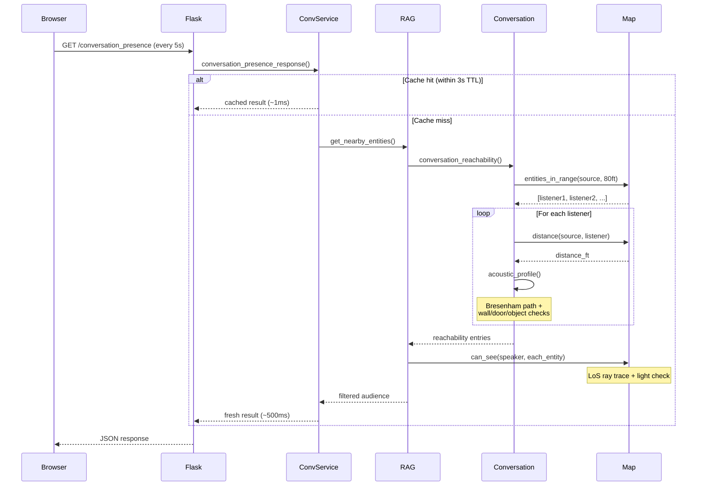

# Conversation System Performance Optimization Plan

## Problem Statement

`GET /conversation_presence` responds in 500-600ms per request, polled every 5 seconds from the frontend ([`local_conversation.js:836`](webapp/static/js/local_conversation.js:836)). Each request triggers expensive acoustic computations for every entity pair on the map.

## Call Chain Analysis

```
GET /conversation_presence
  └─ ConversationService.conversation_presence_response()
       └─ EntityRagHandler.get_nearby_entities(entity, distance_ft, volume, include_extended=True)
            └─ conversation_reachability(source, battle_map, distance_ft, mode)
                 └─ _entities_in_search_radius(source, battle_map, search_distance)  // O(N) scan
                      └─ battle_map.entities_in_range(source, search_distance)       // O(N) distance calc per entity
                 └─ FOR EACH nearby listener (M entities):
                      ├─ battle_map.distance(source, listener)                       // O(1) Euclidean
                      └─ acoustic_profile(source, listener, battle_map)              // EXPENSIVE
                           ├─ battle_map.squares_in_path(...)                        // Bresenham line, O(path_length)
                           └─ FOR EACH square in path:
                                ├─ battle_map.wall(*square)                          // O(1)
                                └─ battle_map.objects_at(*square)                    // O(1) but iterates objects
                                     └─ _closed_door(obj), _wall_like_object(obj)    // attribute lookups
            └─ FOR EACH audience entry:
                 └─ battle_map.can_see(entity, nearby_entity)                        // EXPENSIVE — LoS + light check
```

### Complexity Summary

| Operation | Complexity | Notes |
|-----------|-----------|-------|
| `entities_in_range()` | O(N) | Iterates all map entities, computes distance |
| `acoustic_profile()` | O(P * K) | P = path squares, K = objects per square |
| `can_see()` | O(S * L) | S = entity squares, L = LoS ray trace per square |
| **Total per request** | **O(N + M * (P*K + S*L))** | M = nearby entities, N = total entities |

With 20 entities on a large map, this means ~20 acoustic profiles (each tracing 10-30 squares) plus ~20 visibility checks (each doing full LoS ray traces).

## Identified Optimization Opportunities

### Tier 1: Low-risk, High-impact (Already Implemented)

#### 1.1 Response-level cache (DONE)
- **Status:** Implemented in [`conversation_service.py:1279`](webapp/conversation_service.py:1279)
- **Mechanism:** 3-second TTL cache keyed on `(entity_id, volume, range_value)`
- **Impact:** Eliminates ~60% of redundant computations (5s poll vs 3s TTL)

### Tier 2: Medium-risk, Medium-impact

#### 2.1 Acoustic profile caching with position-based invalidation
- **Problem:** `acoustic_profile(source, listener, battle_map)` is recomputed every poll even when neither entity moved.
- **Solution:** Cache acoustic profiles keyed on `(source_uid, listener_uid, source_pos, listener_pos)` with invalidation on movement events.
- **Implementation:**
  - Add `_acoustic_cache: dict` to `ConversationService` or a module-level LRU cache in `natural20/utils/conversation.py`
  - Key: `(source.entity_uid, listener.entity_uid, source_pos, listener_pos)`
  - Invalidate when movement events are detected (via SocketIO `movement` event listener)
- **Risk:** Cache grows unbounded without eviction. Use `functools.lru_cache(maxsize=512)` or TTL-based dict.

#### 2.2 Visibility check caching
- **Problem:** `battle_map.can_see(entity, nearby_entity)` in the response loop ([`entity_rag_handler.py:1478`](webapp/entity_rag_handler.py:1478)) repeats full LoS + light computation.
- **Solution:** Cache `can_see` results keyed on `(entity1_uid, entity2_uid)` with short TTL (2s) or position-based invalidation.
- **Implementation:** Wrap the `can_see` call in `get_nearby_entities()` with a simple memoization dict.

#### 2.3 Early-exit distance filter before acoustic computation
- **Problem:** `acoustic_profile()` is computed for all nearby entities even when the base distance already exceeds maximum hearing range.
- **Solution:** In `conversation_reachability()`, skip `acoustic_profile()` when `distance_to_source > max_possible_hearing_distance` (shout range + max hearing modifier).
- **Implementation:** Add early return in the loop at [`conversation.py:347`](natural20/utils/conversation.py:347).

#### 2.4 Increase frontend poll interval
- **Problem:** 5-second poll interval is aggressive for data that changes only on entity movement.
- **Solution:** Increase to 10-15 seconds and add event-driven refresh on movement.
- **Implementation:**
  - Change `setInterval` from 5000 to 10000 in [`local_conversation.js:838`](webapp/static/js/local_conversation.js:838)
  - Listen for SocketIO `movement` events and trigger immediate refresh

### Tier 3: Higher-risk, Higher-impact

#### 3.1 Spatial index for entity range queries
- **Problem:** `entities_in_range()` iterates all N entities and computes distance to each.
- **Solution:** Maintain a spatial grid index on the map that allows O(1) range queries by checking only adjacent grid cells.
- **Implementation:** Add a simple grid-based spatial index to `Map` class that maps `(grid_x, grid_y)` → set of entities. Range queries only scan cells within the radius.
- **Risk:** Requires keeping the index in sync with entity movement.

#### 3.2 WebSocket-driven cache invalidation
- **Problem:** Polling is inherently inefficient — the server computes responses even when nothing changed.
- **Solution:** Push conversation presence updates via SocketIO when entities move, instead of polling.
- **Implementation:**
  - Listen for `movement` events in the battle loop
  - When an entity moves, invalidate its cached presence data and push updated presence to affected clients
  - Keep polling as fallback for clients that miss events

#### 3.3 Batch acoustic profile computation
- **Problem:** Each `acoustic_profile()` call independently traces a Bresenham line and iterates squares.
- **Solution:** When computing profiles for multiple listeners from the same source, batch the path computations and share square-level wall/door lookups.
- **Implementation:** Pre-compute a wall/door heatmap for the relevant map region, then each profile just sums penalties along its path.

## Recommended Implementation Order

1. **Tier 2.3** — Early-exit distance filter (simplest, no cache state)
2. **Tier 2.4** — Increase poll interval to 10s (one-line frontend change)
3. **Tier 2.1** — Acoustic profile LRU cache (module-level, position-keyed)
4. **Tier 2.2** — Visibility check cache (short TTL)
5. **Tier 3.4** — SocketIO movement-triggered refresh (event-driven)

## Test Strategy

### Existing Tests (Preserve)
- [`tests/test_conversation_utils.py`](tests/test_conversation_utils.py) — 6 tests for `audible_entities`, `conversation_reachability`, acoustic penalties
- [`tests/test_npc_communication.py`](tests/test_npc_communication.py) — NPC conversation flow tests
- [`tests/webapp/test_talk_route_recipients.py`](tests/webapp/test_talk_route_recipients.py) — Full talk route integration tests

### New Tests to Add

#### Test 1: Cache correctness for `conversation_presence_response`
```python
def test_conversation_presence_cache_returns_stale_result_within_ttl():
    """Cached response should be returned for identical requests within TTL."""
    
def test_conversation_presence_cache_misses_on_different_parameters():
    """Different entity_id, volume, or range_value should bypass cache."""
    
def test_conversation_presence_cache_expires_after_ttl():
    """Cache entry should expire after TTL seconds."""
```

#### Test 2: Acoustic profile cache
```python
def test_acoustic_profile_cache_hits_on_same_positions():
    """Same source/listener at same positions should return cached result."""
    
def test_acoustic_profile_cache_misses_on_position_change():
    """Changed positions should invalidate the cache entry."""
```

#### Test 3: Early-exit distance filter
```python
def test_conversation_reachability_skips_acoustic_for_distant_entities():
    """Entities beyond max hearing range should not trigger acoustic_profile()."""
```

#### Test 4: Regression — acoustic penalty correctness
```python
def test_acoustic_profile_closed_door_penalty():
    """Verify closed door adds 10ft penalty."""
    
def test_acoustic_profile_wall_penalty():
    """Verify wall tiles add 20ft penalty."""
    
def test_acoustic_profile_opaque_object_penalty():
    """Verify opaque objects add 5ft penalty."""
```

#### Test 5: Performance regression guard
```python
def test_conversation_presence_response_performance():
    """Response should complete within 200ms for typical map (10 entities)."""
```

## Mermaid Architecture Diagram



## Risk Assessment

| Optimization | Risk | Mitigation |
|-------------|------|------------|
| Response cache (DONE) | Low — stale data for 3s | Acceptable for presence UI |
| Acoustic LRU cache | Medium — stale if map changes | Position-keyed; invalidates on movement |
| Visibility cache | Medium — stale if entities move | Short TTL (2s); position-keyed |
| Early-exit filter | Low — pure optimization | Correctness preserved by distance math |
| Poll interval increase | Low — UI feels slightly slower | Compensated by event-driven refresh |
| Spatial index | High — sync complexity | Defer until proven needed |
| WebSocket invalidation | Medium — adds complexity | Keep polling as fallback |
