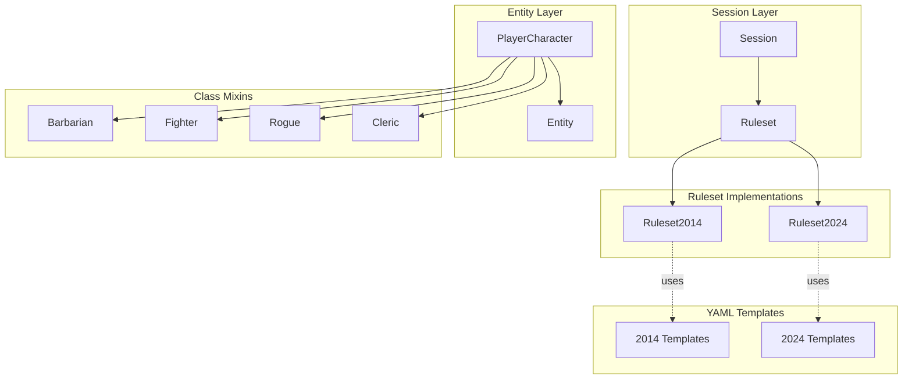

# D&D 5e 2024 Ruleset Support Architecture

## Executive Summary

This document outlines the architecture for adding support for the D&D 5e 2024 Player's Handbook ("2024 rules") alongside the existing 2014 SRD ruleset. The design uses a **ruleset abstraction layer** that allows per-session ruleset selection while minimizing code duplication and preserving backward compatibility.

> **Scope note**: "5e-2024" refers to rules introduced by the 2024 PHB (and 2024 DMG/MM where relevant). It is *not* a wholesale rewrite of 5e — most mechanics carry over. The ruleset abstraction must therefore default to delegating to the 2014 implementation and only override the *small set* of behaviors that genuinely changed.

---

## 1. Key Differences: D&D 5e 2014 vs 2024

> The tables below have been audited against the 2024 PHB. Items that were inaccurate in earlier drafts are flagged with **[Corrected]**. Where 2014 and 2024 are the same, the row is kept for completeness so the ruleset interface designer knows *not* to add an override hook.

### 1.1 Character Creation & Progression

| Feature | 2014 SRD | 2024 Rules |
|---------|----------|------------|
| **Ability Score Source** | Species grants fixed +2/+1 (or similar) bonuses | **[Corrected]** **Background grants ability bonuses** (+2/+1 or +1/+1/+1 chosen from a list of three). **Species no longer grants ability score increases.** |
| **Proficiency Bonus** | Scales 2→6 (levels 1-20) | **Same** (no change) |
| **Saving Throw Proficiencies** | Two per class (e.g., Barbarian STR/CON, Wizard INT/WIS) | **[Corrected]** **Same — still two per class, unchanged from 2014.** Earlier draft was wrong. |
| **Weapon Proficiencies** | Class-based | **[Corrected]** **Still class-based** (e.g., Wizard does not gain martial). New mechanic: martial weapons have a **Weapon Mastery** property usable by classes that grant Weapon Mastery (Barbarian, Fighter, Paladin, Ranger, Rogue at L1; Monk L2). |
| **Armor Proficiencies** | Class-based | **[Corrected]** **Still class-based** (Wizard/Sorcerer still have none). |
| **Skill Proficiencies** | Class-based list with N choices | **[Corrected]** **Still class-based list with N choices.** Background also grants 2 skills (was variable in 2014). |
| **Hit Points** | Level 1: max HD + CON; other levels: roll HD + CON or take fixed average | **Same options exist**, but the **fixed average is the printed default** (rolling is now an optional rule). At level 1 still max HD + CON. |
| **Hit Dice / Level Progression** | Varies by class; 1–20 | **Same** |
| **ASI Levels** | **[Corrected]** Levels 4, 8, 12, 16, 19 (plus extras for Fighter/Rogue) | **Same** levels 4, 8, 12, 16, 19. *FASI is not a 2024 concept* — earlier draft conflated 2024 with Tasha's optional rules. |

### 1.2 Combat & Actions

| Feature | 2014 SRD | 2024 Rules |
|---------|----------|------------|
| **Turn Structure** | Action, Bonus Action, Reaction, plus Movement up to speed | **[Corrected]** **Same.** Movement was never a "Move action" in 2014; both editions allow up to-speed movement freely on your turn, splittable around actions. |
| **Reactions** | 1 per round, refreshes at start of your turn | **[Corrected]** **Still 1 per round.** The 2024 PHB did not double reactions. |
| **Standard Actions Catalog** | Attack, Cast a Spell, Dash, Disengage, Dodge, Help, Hide, Ready, Search, Use an Object, Improvise | **[New]** Added **Influence**, **Magic** (renamed Cast a Spell category), **Study** (replaces some Search uses), **Utilize** (use object). **Help** in combat now requires you to be within 5 ft and grants advantage on next attack roll, only against a creature you can reach. **Hide** explicitly DC 15 Stealth. |
| **Unarmed Strike** | Single melee attack option | **[New]** Standardized choice of **Damage / Grapple / Shove** when you take an unarmed strike. |
| **Two-Weapon Fighting** | Bonus action attack, no ability mod to damage unless feature | **[New]** Off-hand attack happens as part of the **Attack action** (one of your attacks must use a Light weapon you're holding); the bonus action triggers only when chosen and the rules around Nick mastery interact. |
| **Opportunity Attacks** | Triggered when leaving reach | **Same**, but **Disengage** still suppresses them. |
| **Surprise** | Surprised creatures lose first turn | **[New]** Surprise grants **disadvantage on initiative**, no lost turn. |
| **Cover** | 1/2 cover (+2 AC/DEX save), 3/4 cover (+5 AC/DEX save), full cover blocks | **Same** mechanics. |
| **Conditions** | 14 conditions + Exhaustion | **[Corrected]** **15 conditions** total: same list plus standardized **Exhaustion** (10 levels removed; 1–6 levels with linear -2 per level penalty). Some conditions reworded but mechanics largely intact. |
| **Death Saves** | 3 successes / 3 failures | **Same**. |

### 1.3 Class Changes (audited)

> Many earlier entries asserted differences that don't exist in 2024. Below is a corrected high-level summary. **Per-class deep-dives belong in separate sub-plans during Phase 3.**

| Class | Notable 2024 Changes (vs 2014) |
|-------|--------------------------------|
| **Barbarian** | Rage uses by level **2/3/4/4/5/5/6/6/7/7/no-cap@20**; Rage no longer ends if you don't attack/take damage (lasts 10 min). Brutal Strike replaces Brutal Critical. Weapon Mastery at L1. |
| **Bard** | Bardic Inspiration die starts at **d6** (same as 2014). Expertise at L2 & L9. Magical Inspiration baked in. New subclass timing (L3). |
| **Cleric** | Channel Divinity at L1 (was L2). **Divine Order** choice at L1 (Protector / Thaumaturge). Subclass at L3 (was L1). Holy Order replaces Domain features at L1. |
| **Druid** | Wild Shape costs Channel Nature (limited per long rest). Subclass ("Circle") at L3 (was L2). Wild Shape stat block standardized. |
| **Fighter** | Weapon Mastery at L1, Tactical Mind/Shift/Master features added. Subclass at L3. Second Wind multiple uses per long rest scaling. |
| **Monk** | **Ki renamed to Focus Points.** Martial Arts die same. Patient Defense and Step of the Wind cost 1 Focus (Step also grants Disengage + Dash). Stunning Strike DC penalty for missed attempts. Deflect Attacks (any attack, not just missiles). |
| **Paladin** | Divine Smite is a **spell** (1st-level, bonus action) — must use a slot, can be prepared. Lay on Hands pool same. Channel Divinity at L3. Weapon Mastery at L1. |
| **Ranger** | Hunter's Mark integrated as core feature; Favored Enemy now grants Hunter's Mark uses by PB per long rest. Spellcasting at L1 (was L2). Weapon Mastery at L1. |
| **Rogue** | **Sneak Attack die unchanged: 1d6 / two rogue levels.** Cunning Strike (spend Sneak Attack dice for riders) at L5. Steady Aim baked in. Weapon Mastery at L1. |
| **Sorcerer** | Innate Sorcery (free advantage 1/short rest at L1). Metamagic at L2. Sorcerous Restoration tweaked. Subclass at L3. |
| **Warlock** | Pact Magic same shape; **Magical Cunning** L2 (refresh slots 1/short rest). Mystic Arcanum L9/13/17 (was L11/13/15/17 — verify against current text). Eldritch Invocation list reworked. |
| **Wizard** | Subclass at L3 (was L2). Spell Mastery / Signature Spells reworked. Schools redesigned with subclass-specific kits. |

### 1.4 Spell Changes

| Feature | 2014 SRD | 2024 Rules |
|---------|----------|------------|
| **Spell Lists** | Each class has its own list | **[Corrected]** **Three grouped lists** (Arcane, Divine, Primal). Each class draws from one of these lists; classes are *not* fully unified. |
| **Cantrips** | Known at level 1 (varies by class) | Same scaling per class; cantrips can be **swapped on each level-up**. Several cantrips reworked (e.g., **True Strike** is a viable attack cantrip; **Toll the Dead** mechanics adjusted). |
| **Spell Slots** | Class-based progression (full / half / third / Pact) | **[Corrected]** **Same per-class slot tables**; Warlock still uses Pact Magic. There is no single unified slot table. |
| **Prepared Spells** | Class-dependent | **Standardized formula per class** (printed table replaces ability-mod + level math for several classes). Druid/Cleric/Paladin/Wizard/Bard/Sorcerer/Warlock each have a printed Prepared Spells column. |
| **Concentration** | Same | **Same** (interrupted by damage on CON save DC = max(10, half damage)). |
| **Counterspell** | Auto-success at slot ≥ spell level, contest above | **[New]** Now a **CON save** by the caster being countered (DC = your spell save DC); no auto-success. |
| **Spell Damage** | Varies by spell | Some spells changed (e.g., **Chill Touch** now deals necrotic, ranges adjusted) |
| **Concentration** | Same rules | Same rules |

### 1.5 Race/Species Changes

| Feature | 2014 SRD | 2024 Rules |
|---------|----------|------------|
| **Terminology** | "Race" | **"Species"** |
| **Ability Bonuses on Species** | +2/+1 fixed per race (with Tasha's optional floating rule) | **[Corrected]** **Removed.** Species grants no ability score increase; bonuses come from **Background**. |
| **Subraces** | High Elf, Wood Elf, etc. | Mostly folded into species variants or removed; Elf splits into Drow / High / Wood as choices within the Elf species. |
| **Species Roster (PHB 2024)** | Human, Elf, Dwarf, Halfling, Dragonborn, Gnome, Half-Elf, Half-Orc, Tiefling | **[Corrected]** **Aasimar, Dragonborn, Dwarf, Elf, Gnome, Goliath, Halfling, Human, Orc, Tiefling.** (Half-Elf and Half-Orc removed as standalone species; mixed-heritage handled narratively. **Kender is not in the 2024 PHB.**) |
| **Speed** | Often varies (Dwarf 25 ft) | Many speeds normalized to 30 ft; Small species generally still 30 ft now. |

### 1.6 Equipment & Combat Changes

| Feature | 2014 SRD | 2024 Rules |
|---------|----------|------------|
| **Weapon Proficiencies** | Class-based | **[Corrected]** **Still class-based.** New mechanic: **Weapon Mastery properties** (Cleave, Graze, Nick, Push, Sap, Slow, Topple, Vex) attach to specific martial weapons; only certain classes/levels know N masteries at a time. |
| **Armor Proficiencies** | Class-based | **[Corrected]** **Still class-based.** |
| **Armor Stats** | Same | Minor stat tweaks on a few entries; AC formulas unchanged. |
| **Spellcasting Focus** | Arcane / Druidic / Holy Symbol | **Same**, plus standardized rules for using a focus in place of M components without cost. |

---

## 2. Architecture Design

### 2.1 Core Design Principles

1. **Ruleset as a First-Class Citizen**: A `Ruleset` object encapsulates all ruleset-specific behavior
2. **Session-Level Selection**: Each `Session` carries a `ruleset` reference
3. **Backward Compatibility**: Default ruleset is 2014; existing code works unchanged
4. **YAML-Driven Configuration**: Ruleset differences expressed in YAML where possible
5. **Minimal Code Duplication**: Shared logic in base classes; overrides in ruleset-specific classes

### 2.2 High-Level Component Diagram



### 2.3 Ruleset Base Class

```
natural20/ruleset/
├── __init__.py
├── base.py              # Abstract base class defining the ruleset interface
├── ruleset_2014.py      # 2014 SRD implementation (default)
├── ruleset_2024.py      # 2024 Rules Compendium implementation
├── factory.py           # Ruleset factory for session-level selection
└── compatibility/
    ├── __init__.py
    ├── ac_calculator.py # AC calculation abstraction
    ├── damage_calculator.py # Damage calculation abstraction
    └── save_dc_calculator.py # Save DC abstraction
```

### 2.4 Ruleset Interface (Abstract Base) — Audited

> Earlier drafts proposed many hooks for differences that don't actually exist (unified saves, unified weapon/armor proficiencies, FASI, doubled reactions, free movement, sneak attack die, bardic inspiration die, ASI level changes). Those have been **removed**. The interface below contains *only* hooks that correspond to **real** 2024 changes. Adding more later is cheap; over-abstracting now would force every class mixin to consult the ruleset for behavior that never actually diverges.

```python
# natural20/ruleset/base.py (pseudocode, audited surface)

class Ruleset(ABC):
    """Abstract base class for D&D 5e ruleset implementations.

    Defaults live on Ruleset2014. Ruleset2024 overrides only what the
    2024 PHB actually changed. Anything not listed here is *not* a
    per-ruleset hook — either the rule is identical, or the difference
    is data-driven via YAML templates.
    """

    @property
    @abstractmethod
    def name(self) -> str:
        """Ruleset identifier, e.g. '5e-2014' or '5e-2024'."""

    # --- Character HP ---
    def hp_per_level_strategy(self) -> str:
        """'roll' (2014 default) or 'average' (2024 default). Sessions/players
        may still override per-character via existing YAML."""
        return 'roll'

    # --- Combat actions catalog ---
    def standard_actions(self) -> list[str]:
        """Names of standard actions available. 2024 adds Influence, Study,
        Utilize, Magic; 2014 lacks these."""

    def unarmed_strike_modes(self) -> list[str]:
        """['attack'] in 2014; ['attack','grapple','shove'] in 2024 — chosen
        per use of an unarmed strike."""

    def surprise_model(self) -> str:
        """'lose_turn' (2014) or 'initiative_disadvantage' (2024)."""

    def help_action_requires_adjacent(self) -> bool:
        """2024: True (must be within 5 ft for combat Help). 2014: True for
        attack-Help; ability-check Help also requires being able to assist.
        Used to gate UI/auto-targeting."""

    # --- Spells ---
    def counterspell_resolution(self) -> str:
        """'auto_at_or_above' (2014) or 'caster_con_save' (2024)."""

    def spell_grouping(self) -> str:
        """'per_class' (2014) or 'arcane_divine_primal' (2024).
        Drives YAML loader behavior, not call-site logic."""

    # --- Species / Background ability bonuses ---
    def ability_bonus_source(self) -> str:
        """'species' (2014) or 'background' (2024)."""

    # --- Conditions ---
    def exhaustion_model(self) -> str:
        """'levels_1_to_10' (2014) or 'levels_1_to_6_minus_2_per_level' (2024)."""

    # --- Class feature dispatchers ---
    # The following return small data records that class mixins consult.
    # Most class mechanics are identical between rulesets and should NOT
    # go through the ruleset — they are read directly from per-class YAML.

    def paladin_smite_is_spell(self) -> bool:
        """2014: False (class feature). 2024: True (1st-level spell, BA)."""

    def cleric_channel_divinity_level(self) -> int:
        """2014: 2. 2024: 1."""

    def monk_resource_name(self) -> str:
        """'ki' (2014) or 'focus' (2024). Cosmetic/serialization concern."""

    def weapon_mastery_enabled(self) -> bool:
        """2014: False. 2024: True. Gates the Mastery property pipeline."""
```

**Notes on hooks deliberately *not* added:**

- `max_reactions_per_round`, `movement_is_free`, `requires_move_action`, `ability_score_improvement_levels`, `default_*_proficiencies`, `sneak_attack_die`, `bardic_inspiration_die`, `rage_uses_per_rest`, unified spell-slot/spell-list tables — these reflected misunderstandings of the 2024 rules and should not be added.
- Where a class genuinely diverges (e.g., Rogue's Cunning Strike), the divergence is **a new feature** layered on top of unchanged 2014 behavior, not an override. Implement it as a 2024-only YAML feature read by the existing `Rogue` mixin gated on `session.ruleset.name == '5e-2024'`.


### 2.5 Session Integration

The `Session` class is extended to carry a `ruleset` reference. Today its signature is:

```python
# natural20/session.py (verified L22-L23)
class Session:
    def __init__(self, root_path=None, event_manager=None, conversation_handlers=None):
        ...
```

Proposed change:

```python
class Session:
    def __init__(self, root_path=None, event_manager=None,
                 conversation_handlers=None, ruleset=None):
        ...
        from natural20.ruleset.factory import get_ruleset
        # Default 2014 keeps every existing test/save/yaml working unchanged.
        # `ruleset` may be a string id ('5e-2014' / '5e-2024') or a Ruleset instance.
        self.ruleset = get_ruleset(ruleset or self._ruleset_from_game_yml() or '5e-2014')
```

The ruleset id may also be specified in `game.yml` (`ruleset: 5e-2024`) so that pure-data sessions don't need a programmatic constructor argument.

### 2.6 Entity Layer Integration

Most entity methods do **not** need to change. The audited interface is small enough that delegation only happens at a few call sites. For example, the existing reaction tracking already works correctly for both rulesets:

```python
# natural20/entity.py L1795 (verified)
def total_reactions(self, battle):
    if battle:
        entity_state = battle.entity_state_for(self)
        if not entity_state:
            return 1
        return entity_state.get('reaction')
    else:
        return 1
```

No override needed: 2024 keeps the 1-reaction default. (Earlier drafts incorrectly proposed a `max_reactions_per_round` hook.)

However, the **entity_state seeding** in `Battle` *is* a likely future hook for things like Cunning Strike resource pools or Focus Points. Keep those data-driven via the per-class YAML.

### 2.7 PlayerCharacter Integration

```python
# natural20/player_character.py (changes - pseudocode)

class PlayerCharacter(Entity, ...):
    def calculate_subsequent_level_hp(self, klass, hit_die):
        # Existing: uses roll or fixed-average per character YAML.
        # New: when ruleset == '5e-2024' and the YAML did not pin a strategy,
        # default to 'average'.
        strategy = self._hp_strategy_for(klass) \
            or self.session.ruleset.hp_per_level_strategy()
        ...

    # NOTE: do NOT add `available_actions` branches to skip MoveAction.
    # Movement is not an action in either ruleset; the existing code is correct.
```


### 2.8 YAML Template Changes

YAML templates gain a `ruleset` field to indicate compatibility:

```yaml
# templates/char_classes/barbarian.yml (2014)
---
ruleset: 5e-2014
hit_die: 1d12
weapon_proficiencies:
  - light_armor
  - medium_armor
  - shields
  - simple
  - martial
# ... existing content
```

```yaml
# templates_2024/char_classes/barbarian.yml (new)
---
ruleset: 5e-2024
hit_die: 1d12
weapon_proficiencies:  # 2024: all classes get these
  - simple
  - martial
saving_throw_proficiencies:  # 2024: all classes get Wis & Con
  - wisdom
  - constitution
# ... 2024-specific class features
```

### 2.9 Class Mixin Changes

Class mixins (e.g., `Barbarian`, `Rogue`) gain ruleset-aware methods:

```python
# natural20/entity_class/barbarian.py (changes)

class Barbarian:
    def rage_uses(self):
        session = getattr(self, 'session', None)
        if session and session.ruleset.name == '5e-2024':
            return session.ruleset.rage_uses_per_rest(self.barbarian_level)
        # 2014 default
        return RAGE_USES[self.barbarian_level - 1]
    
    def rage_damage_bonus(self):
        # Same for both rulesets at low levels
        return RAGE_DAMAGE[self.barbarian_level - 1]
```

```python
# natural20/entity_class/rogue.py (changes)

class Rogue:
    def sneak_attack_dice(self):
        session = getattr(self, 'session', None)
        if session and session.ruleset.name == '5e-2024':
            # 2024: d8 at level 1, scaling differently
            levels = [
                "1d8", "1d8",
                "2d8", "2d8",
                # ... 2024 progression
            ]
            return levels[self.rogue_level - 1]
        # 2014 default
        return self.sneak_attack_level()
```

---

## 3. Implementation Priority & Phases

### Phase 1: Core Infrastructure (Highest Priority)

1. **Create `natural20/ruleset/` package** with base class and factory
2. **Implement `Ruleset2014`** (mirrors current behavior)
3. **Extend `Session`** to accept and store a ruleset reference
4. **Add ruleset property to Entity** for delegation

### Phase 2: Character & Combat Rules (High Priority)

5. **Implement `Ruleset2024`** for core differences:
   - HP calculation (fixed vs rolling)
   - Reaction limits (1 vs 2)
   - Movement freedom (action vs free)
   - ASI/FASI levels
   - Proficiency tables
6. **Update `PlayerCharacter`** to use ruleset for HP, proficiencies
7. **Update `Entity`** to use ruleset for reactions, movement

### Phase 3: Class-Specific Changes (Medium Priority)

8. **Update class mixins** for ruleset-specific features:
   - Barbarian: Rage uses
   - Bard: Bardic Inspiration die
   - Rogue: Sneak Attack dice, Expertise levels
   - Monk: Ki costs for Patient Defense/Step of the Wind
9. **Create 2024 character class YAML templates**

### Phase 4: Spell System (Medium Priority)

10. **Implement unified spell list** for 2024
11. **Implement unified spell slot table** for 2024
12. **Update spell loading** to use ruleset-specific lists

### Phase 5: Species/Race & Conditions (Lower Priority)

13. **Create 2024 species YAML templates** with FASI
14. **Update species ability bonus logic**
15. **Update condition effects** for renamed/merged conditions

### Phase 6: Testing & Polish (Ongoing)

16. **Write unit tests** for ruleset abstraction
17. **Write integration tests** for session-level ruleset switching
18. **Update web UI** to show ruleset in character sheets
19. **Document** ruleset selection and template creation

---

## 4. File Structure

```
natural20/
├── ruleset/                          # NEW: Ruleset abstraction package
│   ├── __init__.py
│   ├── base.py                       # Abstract base class
│   ├── ruleset_2014.py               # 2014 SRD implementation
│   ├── ruleset_2024.py               # 2024 Rules Compendium implementation
│   ├── factory.py                    # Factory for ruleset selection
│   └── compatibility/                # Shared calculation helpers
│       ├── __init__.py
│       ├── ac_calculator.py
│       ├── damage_calculator.py
│       └── save_dc_calculator.py
├── entity.py                         # MODIFIED: Add ruleset delegation
├── player_character.py               # MODIFIED: Ruleset-aware HP, actions
├── entity_class/
│   ├── barbarian.py                  # MODIFIED: Ruleset-aware rage
│   ├── bard.py                       # MODIFIED: Ruleset-aware bardic inspiration
│   ├── rogue.py                      # MODIFIED: Ruleset-aware sneak attack
│   ├── monk.py                       # MODIFIED: Ruleset-aware ki costs
│   └── ...                           # Other class mixins may need updates
├── session.py                        # MODIFIED: Add ruleset parameter
├── actions/
│   ├── move_action.py                # MAYBE MODIFIED: Skip in 2024
│   └── ...
├── spell/
│   ├── spell.py                      # MAYBE MODIFIED: Ruleset-aware spell lists
│   └── ...
└── utils/
    ├── spell_loader.py               # MAYBE MODIFIED: Ruleset-aware loading

templates_2024/                       # NEW: 2024-specific YAML templates
├── char_classes/
│   ├── barbarian.yml
│   ├── bard.yml
│   ├── cleric.yml
│   ├── druid.yml
│   ├── fighter.yml
│   ├── monk.yml
│   ├── paladin.yml
│   ├── ranger.yml
│   ├── rogue.yml
│   ├── sorcerer.yml
│   ├── warlock.yml
│   └── wizard.yml
├── characters/
│   └── ...                           # 2024-specific character templates
├── races/                            # Renamed to species/ in 2024
│   ├── human.yml
│   ├── elf.yml
│   └── ...
├── items/
│   ├── spells.yml                    # 2024 spell list
│   ├── weapons.yml
│   └── equipment.yml
└── maps/
    └── ...

tests/
├── test_ruleset/                     # NEW: Ruleset tests
│   ├── test_base.py
│   ├── test_ruleset_2014.py
│   ├── test_ruleset_2024.py
│   ├── test_factory.py
│   └── test_session_ruleset.py
└── ...                               # Existing tests (should still pass)
```

---

## 5. Ruleset-Specific Differences Summary Table (Audited)

| Feature | 2014 Implementation | 2024 Implementation |
|---------|---------------------|---------------------|
| **HP Level 1** | `max(HD) + CON` | `max(HD) + CON` (same) |
| **HP Other Levels** | `roll(HD) + CON` (or take fixed average) | **Fixed average is the printed default**; rolling now optional |
| **Reactions/Round** | 1 | **1 (unchanged)** |
| **Movement** | Up to speed, free, splittable | **Same** |
| **ASI Levels** | 4, 8, 12, 16, 19 (+ class extras) | **Same** |
| **Species ability bonus** | Fixed per species | **None — moved to Background** |
| **Background grants ability bonus** | No (granted by species) | **Yes: +2/+1 or +1/+1/+1** |
| **Saving Throws** | Class pair (e.g., Wiz INT/WIS) | **Same class pairs** |
| **Weapon Proficiencies** | Class-based | **Class-based + Weapon Mastery** for some classes |
| **Armor Proficiencies** | Class-based | **Class-based (same)** |
| **Skill Proficiencies** | Class N + Background 2 (often fixed) | **Class N + Background 2 (Background skills now standardized to 2)** |
| **Rage Uses (L1)** | 2 | **2** (table rebalanced at higher levels; never ends from inactivity) |
| **Bardic Inspiration die (L1)** | d6 | **d6 (unchanged)** |
| **Sneak Attack** | 1d6 / 2 rogue levels | **1d6 / 2 rogue levels (unchanged)**; new **Cunning Strike** spends dice |
| **Expertise (Rogue)** | L1 | **L1 (unchanged)** |
| **Channel Divinity (Cleric)** | L2 | **L1** |
| **Divine Smite (Paladin)** | Class feature, free with slot | **Spell** (1st-level, bonus action) |
| **Spell Lists** | Per-class | **Three grouped lists (Arcane/Divine/Primal)**, classes still draw subsets |
| **Spell Slot Tables** | Per-class | **Per-class (unchanged shape)**; Pact Magic still separate for Warlock |
| **Counterspell** | Auto-success at slot ≥ spell level | **CON save by target caster** |
| **Surprise** | Lose first turn | **Disadvantage on initiative** |
| **Unarmed Strike** | Single attack | **Choose Damage / Grapple / Shove** |
| **Conditions** | 14 + Exhaustion (10 levels) | **15** entries; Exhaustion redesigned (1–6, -2/level) |

---

## 6. Migration Strategy

### 6.1 Existing Content

- **Existing YAML templates** remain valid for 2014 ruleset
- **Existing characters** load correctly with default 2014 ruleset
- **Existing maps/sessions** work unchanged

### 6.2 New 2024 Content

- **New YAML templates** in `templates_2024/` directory
- **New characters** specify `ruleset: 5e-2024` in game.yml
- **Session creation** accepts `ruleset='5e-2024'` parameter

### 6.3 Conversion Tools

Future work may include:
- **Character converter**: 2014 → 2024 (adjusting HP, proficiencies, features)
- **YAML migrator**: Update 2014 templates to 2024 format

---

## 7. Testing Strategy

### 7.1 Unit Tests

- **Ruleset base class**: Verify interface contract
- **Ruleset2014**: Verify all methods return 2014 values
- **Ruleset2024**: Verify all methods return 2024 values
- **Factory**: Verify correct ruleset creation by name
- **Session integration**: Verify ruleset is stored and accessible

### 7.2 Integration Tests

- **Character creation**: Verify HP, proficiencies, features per ruleset
- **Combat**: Verify reactions, movement, actions per ruleset
- **Spell casting**: Verify spell lists, slots per ruleset
- **Class features**: Verify rage, sneak attack, bardic inspiration per ruleset

### 7.3 Regression Tests

- **Existing tests**: All existing tests must pass with default 2014 ruleset
- **Save/load**: Verify savegame compatibility with default ruleset

---

## 8. Open Questions — Resolved Decisions

1. **Where do 2024 templates live?** — **Decision: same `templates/` directory, with a `ruleset:` field in each YAML.** Rationale: avoids a duplicated tree, matches how `templates/index.json` is consumed today, and the loader can fall back to the 2014 file when a 2024 variant is absent. A `templates_2024/` subtree may still be created *under* `templates/` purely as an organizational convenience for content authors.
2. **Per-session vs global ruleset** — **Decision: per-session.** Stored on `Session.ruleset`; never read from a global.
3. **Partial adoption / mix-and-match** — **Decision: support a `ruleset_overrides` dict on `Session`** (e.g. `{ 'spell_grouping': 'per_class' }`). The `Ruleset` base reads overrides via `self.ruleset.get(name)`-style accessors, with the underlying ruleset providing defaults.
4. **Errata variant (`5e-2014-errata`)** — **Out of scope for v1.** Easy to add later as a `Ruleset2014` subclass once the v1 hooks are stable.
5. **Web UI** — **Required:** session-create flow must let the DM choose the ruleset; character sheet shows the active ruleset; per-character HP strategy and ability-bonus source must reflect it.
6. **Missing-feature fallback** — **Decision: when a 2024 template is absent, the loader falls back to the 2014 template and logs a warning.** Hard errors only when the *requested* feature is ruleset-incompatible (e.g., asking for Weapon Mastery in a 2014 session).
7. **Save/Load** — the saved state must persist `ruleset` id and any `ruleset_overrides`. Existing saves load as `5e-2014` (default).

---

## 9. Timeline Estimate (Phases Only, No Effort Estimates)

| Phase | Scope | Dependencies |
|-------|-------|--------------|
| Phase 1 | Core infrastructure | None |
| Phase 2 | Character & combat rules | Phase 1 |
| Phase 3 | Class-specific changes | Phase 2 |
| Phase 4 | Spell system | Phase 2 |
| Phase 5 | Species & conditions | Phase 3 |
| Phase 6 | Testing & polish | All previous phases |

---

## 10. Appendix: Example `Ruleset2024` Implementation Sketch (Audited)

```python
# natural20/ruleset/ruleset_2024.py (pseudocode)

from natural20.ruleset.base import Ruleset
from natural20.ruleset.ruleset_2014 import Ruleset2014


class Ruleset2024(Ruleset2014):
    """2024 PHB ruleset. Inherits from Ruleset2014 and overrides ONLY the
    behaviors that genuinely changed in the 2024 PHB."""

    @property
    def name(self):
        return '5e-2024'

    # --- HP defaults ---
    def hp_per_level_strategy(self):
        return 'average'  # printed default in 2024 PHB

    # --- Combat actions catalog ---
    def standard_actions(self):
        return super().standard_actions() + ['influence', 'study', 'utilize', 'magic']

    def unarmed_strike_modes(self):
        return ['attack', 'grapple', 'shove']

    def surprise_model(self):
        return 'initiative_disadvantage'

    # --- Spells ---
    def counterspell_resolution(self):
        return 'caster_con_save'

    def spell_grouping(self):
        return 'arcane_divine_primal'

    # --- Ability bonuses ---
    def ability_bonus_source(self):
        return 'background'

    # --- Conditions ---
    def exhaustion_model(self):
        return 'levels_1_to_6_minus_2_per_level'

    # --- Class feature dispatchers ---
    def paladin_smite_is_spell(self):
        return True

    def cleric_channel_divinity_level(self):
        return 1

    def monk_resource_name(self):
        return 'focus'

    def weapon_mastery_enabled(self):
        return True
```

Note that `Ruleset2024` is **only ~50 lines**. That's a feature, not a limitation: it correctly reflects how little the 2024 PHB changed compared to 2014. Anything larger likely indicates the abstraction is creeping into class-mixin or YAML territory.

---

## 11. Conclusion

This architecture provides a clean, extensible way to support both D&D 5e 2014 and 2024 rulesets. The key design decisions are:

1. **Ruleset as a first-class object** — encapsulates the *narrow* set of behaviors that actually differ between editions.
2. **Session-level selection** — allows per-campaign ruleset choice, supports `ruleset_overrides` for partial adoption.
3. **Backward compatibility** — existing content, saves, and tests work unchanged because `Ruleset2014` is the default and `Ruleset2024` inherits from it.
4. **YAML-driven configuration** — the bulk of 2024 content (new species, new class features like Cunning Strike, Weapon Mastery data) lives in YAML, not in Python overrides.
5. **Minimal interface surface** — the audited interface contains roughly a dozen methods, not the 25+ originally proposed. Hooks correspond 1:1 to verified PHB-2024 changes.

The implementation should proceed in phases, starting with core infrastructure (Phase 1), then HP/conditions/actions (Phase 2), then class-feature deltas (Phase 3), then spell-grouping/Counterspell/Smite-as-spell (Phase 4), then species/background restructuring (Phase 5), and ongoing testing (Phase 6).

---

## 12. Verified Codebase Hooks (where to plug in)

The following call sites were verified against the current `main` branch and are the concrete touchpoints for Phase 1–2 work. Skim them before authoring the `Ruleset` base class so the abstraction matches what the engine actually does.

| Concern | Current location | Phase | Notes |
|---|---|---|---|
| Session bootstrap | [natural20/session.py](natural20/session.py#L22-L23) `class Session` / `__init__` | 1 | Add `ruleset=` kwarg; read `ruleset:` from `game.yml`. |
| Reactions per round | [natural20/entity.py](natural20/entity.py#L1795) `total_reactions` | 1 | **No change required** — verified that 2024 keeps 1/round. |
| HP per level | [natural20/player_character.py](natural20/player_character.py#L140-L169) HD bookkeeping | 2 | Branch on `session.ruleset.hp_per_level_strategy()` for the *default*; per-character YAML still wins. |
| Save/load round-trip | [natural20/player_character.py](natural20/player_character.py#L1065) (`to_dict`) and [#L1093-L1094](natural20/player_character.py#L1093-L1094) (`from_dict`) | 1 | Persist `ruleset` id at the session level. Per-character serialization unchanged. |
| Action catalog | natural20/actions/ | 2 | Add new 2024 actions (Influence, Study, Utilize) as new `Action` subclasses gated by `session.ruleset.standard_actions()`. |
| Spell grouping | [natural20/utils/spell_loader.py](natural20/utils/spell_loader.py) | 4 | When `spell_grouping() == 'arcane_divine_primal'`, resolve class→list lookups through grouping metadata in `templates/items/spells.yml`. |
| Counterspell | natural20/spell/ (Counterspell class) | 4 | Branch resolution on `counterspell_resolution()`. |
| Paladin Smite | natural20/entity_class/paladin.py and any Smite action | 3 | When `paladin_smite_is_spell()` is True, present Smite as a 1st-level bonus-action spell rather than a free rider on a hit. |
| Monk resource label | natural20/entity_class/monk.py | 3 | Pure label/serialization — internal counter stays the same. Map old `ki` save fields to `focus` on read. |
| Web UI | webapp/templates/ + webapp/static/engine.js | 2 | Add session-create ruleset selector; surface `session.ruleset.name` on the character sheet. |

---

## 13. Extending the Ruleset System (Developer Guide)

When adding a new ruleset (e.g., `5e-2014-errata`, a homebrew variant, or a future PHB update):

1. **Subclass the closest existing ruleset.** Do NOT subclass `Ruleset` directly unless you genuinely diverge from both 2014 and 2024.
2. **Register the new id in `natural20/ruleset/factory.py`.**
3. **Override only the methods that change.** If you find yourself overriding more than ~20 methods, the abstraction is wrong — file an issue first.
4. **Add YAML overlays under `templates/<your_ruleset_id>/`** (or use the `ruleset:` field on individual files). The loader resolves overlays in this order: requested ruleset → parent ruleset → 2014 default.
5. **Add a unit-test module under `tests/test_ruleset/test_<your_ruleset_id>.py`** that asserts the diffs you care about, plus a regression test that loads a stock character without errors.
6. **Document the ruleset** in `natural20/ruleset/README.md` (created in Phase 1) with a short rationale, the list of overridden methods, and the YAML overlay layout.

### Performance notes

- `session.ruleset` is created once per `Session`; do **not** instantiate `Ruleset` objects per turn.
- Ruleset methods should be pure / cheap. If a method needs to load YAML, cache it on the ruleset instance.
- Avoid `getattr(session, 'ruleset', None)` chains in hot paths; assume `session.ruleset` exists once Phase 1 lands and unit-test the migration.

### Error-handling contract

- Asking the ruleset for a feature it doesn't know about (`ruleset.foo()` where `foo` was added later): raise `AttributeError` — do not silently return `None`.
- Asking for a YAML asset missing in the requested ruleset overlay: log a warning and fall back to the parent ruleset's asset. **Hard error** only when the asset is ruleset-incompatible (e.g., asking for Weapon Mastery data in a `5e-2014` session).
