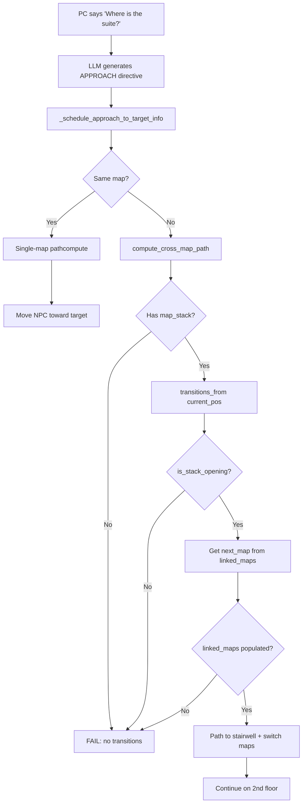

# NPC Cross-Map Navigation Analysis: Pip/Mara to 2nd Floor Suite

## Executive Summary

**Problem:** NPCs (Pip Barmaid, Mara Bartender) cannot guide the PC to the tavern suite on the 2nd floor. The LLM generates correct `[APPROACH: target=@mira, distance=5]` directives for social approach, but when the NPC needs to navigate across maps (from `town_market` to `tavern_2nd_floor`), cross-map pathfinding returns zero segments.

**Root Causes Identified:**
1. **Teleporter target_position mismatch:** STAIRS_UP on town_market targets `[1,0]` on 2nd floor, but the 2nd floor teleporter is at `[0,0]`. The NPC paths to `[1,0]` which is the wall/door next to the actual teleporter.
2. **Map stack world coordinate offset:** The `anchor: [9, 16]` for tavern_2nd_floor means world cell (9,16) on town_market corresponds to local (0,0) on 2nd floor. The `transitions_from` function uses world coordinates, but the pathfinder needs correct local-to-world alignment.
3. **Stack opening bounds span two cells:** The `tavern_stair_shaft` annotation on town_market has bounds `x1=9, y1=16, x2=9, y2=17`, creating world cells (9,16) AND (9,17). But the STAIRS_UP teleporter is only at `[9,16]`.
4. **linked_maps may not propagate:** While `Session._load_all_maps` adds all maps as linked, the cross-map pathfinder depends on `current_map.linked_maps.get(next_name)` returning the correct map object.

## Problem Summary

---

## Map Stack Configuration

The `amphail_tavern` map stack is defined in [`game.yml`](user_levels/wild_sheep_chase/game.yml:45):

```yaml
map_stacks:
- name: amphail_tavern
  floors:
  - map: tavern_2nd_floor
    anchor: [9, 16]
  - base: town_market
    default_story_height_ft: 15
```

**Key insight:** `tavern_2nd_floor` is the **overlay** with `anchor: [9, 16]`, and `town_market` is the **base**. This means:

| Floor | Map | World origin offset |
|-------|-----|-------------------|
| Base | `town_market` | (0, 0) |
| Overlay | `tavern_2nd_floor` | (9, 16) — cells at (0,0)-(8,16) on 2nd floor map align to world cells (9,16)-(17,32) |

---

## Stair/Teleporter Configuration

### Town Market (Base) — STAIRS_UP at [9, 16]

```yaml
# town_market.yml lines 259-268
- token: STAIRS_UP
  pos:
  - 9
  - 16
  layer: object
  target_map: tavern_2nd_floor
  target_position:
  - 1
  - 0
  label: ''
```

The legend entry:
```yaml
# town_market.yml line 999-1001
STAIRS_UP:
  name: stairs_up
  type: teleporter
```

### Tavern 2nd Floor (Overlay) — Teleporter at [0, 0]

```yaml
# tavern_2nd_floor.yml lines 358-367
- token: T
  pos:
  - 0
  - 0
  layer: object
  target_map: town_market
  target_position:
  - 9
  - 17
  label: ''
```

```yaml
# tavern_2nd_floor.yml lines 462-469
T:
  name: Teleporter
  type: teleporter
  target_map: town_market
  target_position:
  - 9
  - 17
  label: ''
```

### Map Annotations — Stack Openings

**Town Market:**
```yaml
# town_market.yml lines 1023-1033
- id: tavern_stair_shaft
  label: Stairwell to guest rooms
  kind: stack_opening
  stack: amphail_tavern
  shape: area
  bounds:
    x1: 9
    y1: 16
    x2: 9
    y2: 17
  description: Stairs up to the Prancing Flagon guest rooms.
```

**2nd Floor:**
```yaml
# tavern_2nd_floor.yml lines 476-486
- id: tavern_stair_shaft
  label: Stairwell shaft
  kind: stack_opening
  stack: amphail_tavern
  shape: area
  bounds:
    x1: 0
    y1: 0
    x2: 0
    y2: 0
  description: Shared stairwell down to the taproom.
```

---

## Root Cause Analysis

### Issue 1: Teleporter target_position offset mismatch

The town_market STAIRS_UP at `[9, 16]` targets `tavern_2nd_floor` position `[1, 0]`:

```
Source (town_market): (9, 16)
Target (tavern_2nd_floor): (1, 0)
```

The teleporter at `[0, 0]` on 2nd floor targets `town_market` position `[9, 17]`:

```
Source (tavern_2nd_floor): (0, 0)
Target (town_market): (9, 17)
```

**Note:** The up path goes to `[1, 0]` and down path goes to `[9, 17]` — these are adjacent cells but not the same. This asymmetry is fine for bidirectional navigation, but the target on 2nd floor is `[1, 0]` not `[0, 0]` where the teleporter actually sits.

### Issue 2: Map stack world coordinate alignment

With `anchor: [9, 16]`, the world-to-local conversion is:

```python
# map_stack.py lines 135-147
def world_to_local(self, wx: int, wy: int, map_name: str):
    floor = self._by_map_name.get(map_name)
    if floor is None:
        return None
    if floor.is_base:
        if 0 <= wx < floor.map.size[0] and 0 <= wy < floor.map.size[1]:
            return (wx, wy)
        return None
    ax, ay = floor.anchor
    lx, ly = wx - ax, wy - ay
    if 0 <= lx < floor.map.size[0] and 0 <= ly < floor.map.size[1]:
        return (lx, ly)
    return None
```

When the NPC is at `[9, 16]` on `town_market` and the pathfinder tries to transition:

1. `local_to_world(2nd_floor, 0, 0)` → `(9, 16, elev)` — the stairwell
2. `transitions_from(town_market, 9, 16)` should return `('tavern_2nd_floor', 0, 0)`

### Issue 3: `transitions_from` requires `is_stack_opening` check

The critical function [`MapStack.transitions_from`](natural20/map_stack.py:194):

```python
def transitions_from(self, map_name: str, lx: int, ly: int) -> list[tuple[str, int, int]]:
    floor = self.floor_for_map(map_name)
    if floor is None:
        return []
    wx, wy, elev = self.local_to_world(map_name, lx, ly)
    results: list[tuple[str, int, int]] = []
    if self.is_stack_opening(wx, wy):  # <-- KEY CHECK
        lower = self.lower_floor_at(wx, wy, elev)
        if lower and lower.map_name != map_name:
            local = self.world_to_local(wx, wy, lower.map_name)
            if local:
                results.append((lower.map_name, local[0], local[1]))
        upper = self.upper_floor_at(wx, wy, elev)
        if upper and upper.map_name != map_name:
            local = self.world_to_local(wx, wy, upper.map_name)
            if local:
                results.append((upper.map_name, local[0], local[1]))
    return results
```

And [`is_stack_opening`](natural20/map_stack.py:188):
```python
def is_stack_opening(self, wx: int, wy: int) -> bool:
    return any(o.wx == wx and o.wy == wy for o in self._openings)
```

The stack opening on town_market is at world cells **(9,16) and (9,17)** (bounds: x1=9, y1=16, x2=9, y2=17). The NPC must be AT one of these world cells for the transition to fire.

### Issue 4: The `_annotation_home_map` function may return the wrong map

When the APPROACH directive targets `tavern_suite_room` (an annotation on `tavern_2nd_floor`), the code path goes:

1. [`NpcMovementHelper._immediate_landmark_square`](n20-webapp/webapp/npc_movement.py:122):
   ```python
   annotation_map = self._annotation_home_map(target_info) or battle_map
   dest_square = annotation_anchor_square(annotation, annotation_map)
   ```

2. If `annotation_map` is `tavern_2nd_floor` but the NPC is on `town_market`, the code calls [`compute_cross_map_path`](natural20/ai/path_compute.py:476).

### Issue 5: Cross-map pathfinder expands via stack transitions AND teleporters

The [`compute_cross_map_path`](natural20/ai/path_compute.py:566-607) algorithm:

```python
# Line 566-584: Expand via stack openings (stairs/shafts)
stack = getattr(current_map, 'map_stack', None)
if stack is not None:
    for next_name, nx, ny in stack.transitions_from(current_map.name, x, y):
        next_map = current_map.linked_maps.get(next_name)
        if next_map is None:
            continue
        # ... path to (nx, ny) on current map, then switch
```

For this to work:
1. The NPC must be able to path **to the stairwell cell** `[9, 16]` on `town_market`
2. The `stack.transitions_from('town_market', 9, 16)` must return `('tavern_2nd_floor', 0, 0)`
3. The `linked_maps` dict on `town_market` must contain `tavern_2nd_floor`

### Issue 6: The `linked_maps` dict may not be populated

The cross-map pathfinder at line 570 uses:
```python
next_map = current_map.linked_maps.get(next_name)
```

Similarly for teleporters at line 595:
```python
next_map = current_map.linked_maps.get(tport.target_map)
```

If `linked_maps` is not populated during map loading, the cross-map transition fails silently.

---

## Investigation Checklist

### 1. Verify `linked_maps` population

Check [`Session`](natural20/session.py) or map loading code to confirm `linked_maps` is populated for the `town_market` map with `tavern_2nd_floor`.

### 2. Verify stack opening registration

Check that the `tavern_stair_shaft` annotation on `town_market` is correctly registered as a stack opening. The annotation at bounds `x1=9, y1=16, x2=9, y2=17` should create world cells `(9,16)` and `(9,17)`.

### 3. Verify NPC position

Confirm Pip/Mara's actual position on `town_market`. If they are NOT at or near `[9, 16]`, the pathfinder needs to compute a path to the stairwell first.

### 4. Verify target_info resolution

Check how `[APPROACH: target=@mira, distance=5]` resolves. The `@mira` is the PC (Mira), and the APPROACH directive targets the PLAYER not the suite. The NPC should approach the player, not the suite.

### 5. Verify known_landmarks on NPC

Pip and Mara have `known_places: [amphail_market, taproom, stockroom, landmark_hallway, landmark_standard_room_1, landmark_standard_room_2, landmark_tavern_room_3, landmark_standard_room_4, tavern_suite_room]` in [`town_market.yml`](user_levels/wild_sheep_chase/maps/town_market.yml:641-650).

The `tavern_suite_room` landmark is defined on `tavern_2nd_floor` at `[1, 3]`. The NPC knows this place exists but needs to path there.

---

## Potential Fixes

### Fix 1: Ensure `linked_maps` is populated

The `Session` loading code must add `tavern_2nd_floor` to `town_market.linked_maps` when the map stack references it.

### Fix 2: Add explicit `linked_maps` in map YAML

If auto-population is unreliable, add:
```yaml
# In town_market.yml
linked_maps:
  - tavern_2nd_floor
```

### Fix 3: Fix teleporter target position

Change the STAIRS_UP target from `[1, 0]` to `[0, 0]` on 2nd floor to match the teleporter position:
```yaml
# town_market.yml
- token: STAIRS_UP
  pos: [9, 16]
  target_map: tavern_2nd_floor
  target_position: [0, 0]  # Changed from [1, 0]
```

### Fix 4: Verify stack opening bounds

The town_market annotation bounds `x1=9, y1=16, x2=9, y2=17` create two world cells. But the STAIRS_UP is only at `[9, 16]`. Verify this doesn't cause issues.

---

## Testing Strategy

1. **Unit test:** Add a test that loads the `wild_sheep_chase` campaign and calls `compute_cross_map_path` from Pip's position `[9, 16]` on `town_market` to the suite at `[1, 3]` on `tavern_2nd_floor`.

2. **Integration test:** Run a `/talk` interaction where the PC asks for directions to their suite and verify the NPC approaches.

3. **Debug logging:** Add logging to `transitions_from` and `_iter_teleporters_on` to verify the graph is correctly constructed.

---

## Conversation System Flow

The log shows the flow:
1. User says "hi pip"
2. Pip responds with APPROACH directive: `[APPROACH: target=@mira, distance=5]`
3. LLM reply is delivered but the APPROACH movement is scheduled via `schedule_npc_move_to`
4. The approach targets the **player** (@mira), not the suite

The actual problem is that the NPC **can** approach the player when they're on the same map. The issue is when the NPC needs to **lead** the player to a different map (2nd floor).

For "guide to suite" to work, the NPC would need to:
1. Approach the player (if not already adjacent)
2. Then move toward `tavern_suite_room` annotation on `tavern_2nd_floor`

The cross-map pathfinder is only invoked when the NPC's target is on a **different map** from the NPC's current map.

---

## Architecture Diagram



---

## Recommended Investigation Priority

1. **High:** Verify `linked_maps` dict population for `town_market`
2. **High:** Verify `is_stack_opening` returns true for NPC position
3. **Medium:** Check that `transitions_from` returns correct target coordinates
4. **Medium:** Verify teleporter objects are found by `_iter_teleporters_on`
5. **Low:** Fix teleporter target position mismatch
