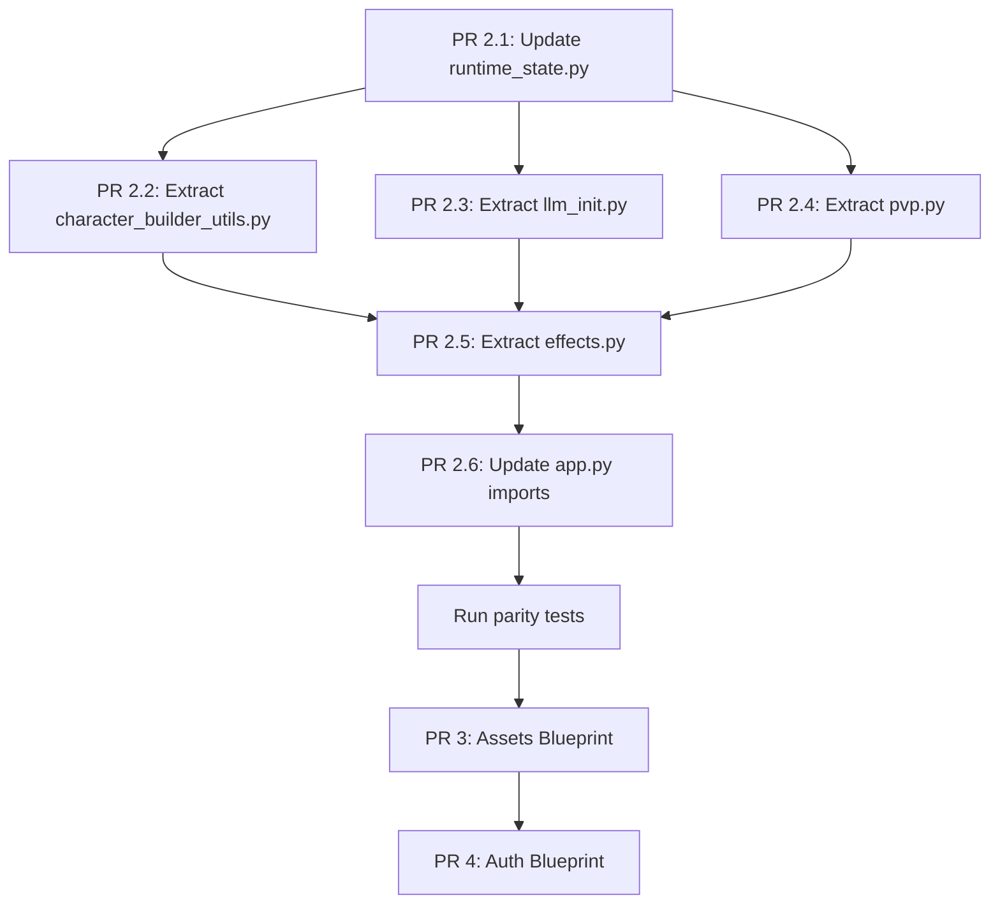

# Execution Plan: PR 2 (Complete), PR 3, PR 4

## Overview

PR 1 (Baseline Parity Harness) is complete. PR 2 (Helper Extraction Foundation) is partially done with 4 of 8 helper modules extracted. This plan details the remaining work for PR 2 and the next two blueprint extractions (PR 3: Assets, PR 4: Auth).

### Current State Summary

| Component | Status | Details |
|---|---|---|
| `plans/artifacts/*.json` | ✅ Done | 3 baseline artifacts |
| `tests/webapp/test_*_parity.py` | ✅ Done | 3 parity tests |
| `webapp/blueprints/__init__.py` | ✅ Done | Package init |
| `webapp/blueprints/helpers/auth_utils.py` | ✅ Done | 3 functions |
| `webapp/blueprints/helpers/template_globals.py` | ✅ Done | 239 lines |
| `webapp/blueprints/helpers/action_utils.py` | ✅ Done | 132 lines |
| `webapp/blueprints/helpers/runtime_state.py` | ⚠️ Partial | Missing `get_event_manager()` |
| `webapp/blueprints/helpers/character_builder_utils.py` | ❌ Missing | 13 functions |
| `webapp/blueprints/helpers/llm_init.py` | ❌ Missing | 3 functions + MCP bridge |
| `webapp/blueprints/helpers/pvp.py` | ❌ Missing | 9 functions |
| `webapp/blueprints/helpers/effects.py` | ❌ Missing | 12 functions + event listeners |
| `app.py` | 8090 lines | Target: ~300 lines |

---

## PR 2 Completion: Remaining Helper Extractions

### 1. Extract `helpers/character_builder_utils.py`

**Source:** [`webapp/app.py`](webapp/app.py:2480), lines 2480-3200

**Functions to extract:**

| Function | Line | Dependencies |
|---|---|---|
| `_parse_json_list_form(form, key)` | 2480 | `json` (stdlib) |
| `_parse_json_dict_form(form, key)` | 2493 | `json` (stdlib) |
| `_ability_mod(score)` | 2509 | none |
| `_spell_choice_caps(klass, level, ability, class_def)` | 2516 | none |
| `_apply_class_and_feat_choices(pc, ...)` | 2590 | `natural20.player_character` |
| `_resolve_character_yaml_path(character_name)` | 2644 | `game_session.root_path` → `runtime_state.get_game_session()` |
| `_can_edit_character(character_name)` | 2674 | `builder_only_mode()` → `runtime_state`, `game_session` |
| `_make_circular_token(pil_img, ...)` | 2703 | `PIL.Image` |
| `_decode_data_url_image(data_url)` | 2735 | `base64`, `io`, `PIL.Image` |
| `_resolve_prebuilt_character_image(name)` | 2753 | `game_session.root_path` → `runtime_state` |
| `_save_character_images(entity_uid, ...)` | 2769 | `os`, `PIL.Image` |
| `_load_character_image_from_request(req, ...)` | 2797 | above image helpers |
| `_register_new_character_in_campaign(pc, safe_name)` | 3149 | `current_game`, `game_session` → `runtime_state` |

**Import pattern:**
```python
# webapp/blueprints/helpers/character_builder_utils.py
from .runtime_state import get_current_game, get_game_session, get_builder_only_mode
```

**Test file:** `tests/webapp/test_helpers_character_builder.py`
- Test `_parse_json_list_form` with valid/invalid JSON
- Test `_parse_json_dict_form` with valid/invalid JSON
- Test `_ability_mod` for standard D&D ability scores
- Test `_make_circular_token` produces 256x256 PNG

---

### 2. Extract `helpers/llm_init.py`

**Source:** [`webapp/app.py`](webapp/app.py:843), lines 843-1100

**Functions to extract:**

| Function | Line | Dependencies |
|---|---|---|
| `register_game_context_functions()` | 843 | `llm_handler`, `game_context_provider`, `_mcp_registry`, `_mcp_context` → `runtime_state` |
| `configure_llm_handler_from_environment(handler)` | 1012 | `os.environ`, `llm_handler` module |
| `initialize_llm_from_env()` | 1090 | above |

**Note:** The MCP bridge (`mcp_call_bridge`) is a nested function inside `register_game_context_functions()`. Keep it nested to preserve closure access to `_mcp_registry` and `_mcp_context`.

**Import pattern:**
```python
# webapp/blueprints/helpers/llm_init.py
from .runtime_state import get_llm_handler
from webapp.game_context import GameContextProvider
```

**Test file:** `tests/webapp/test_helpers_llm_init.py`
- Test `configure_llm_handler_from_environment` with mock handler
- Test provider selection logic for different `LLM_PROVIDER` values

---

### 3. Extract `helpers/pvp.py`

**Source:** [`webapp/app.py`](webapp/app.py:1145), lines 1145-1520

**Functions to extract:**

| Function | Line | Dependencies |
|---|---|---|
| `selectable_character_entry(character_name)` | 1145 | `index_data` → `runtime_state.get_index_data()` |
| `pvp_team_config()` | 1152 | `index_data` |
| `pvp_team_counts()` | 1159 | `CONTROLLERS` → `runtime_state.get_controllers()` |
| `ensure_character_entity_loaded(character_name)` | 1174 | `current_game`, `game_session`, `PlayerCharacter` |
| `assign_character_team_and_spawn(character_name, team)` | 1268 | above + `CONTROLLERS` |
| `ensure_controller_entry(entity_uid)` | 1343 | `CONTROLLERS` |
| `spawn_deferred_entity(entity_uid)` | 1358 | `current_game` |
| `pvp_autofill_candidates()` | 1382 | above |
| `autofill_pvp_battle_turn_order(turn_order)` | 1432 | above + `user_role()` from `auth_utils` |

**Import pattern:**
```python
# webapp/blueprints/helpers/pvp.py
from .runtime_state import (
    get_current_game,
    get_game_session,
    get_index_data,
    get_controllers,
)
from .auth_utils import user_role
from natural20.player_character import PlayerCharacter
```

**Test file:** `tests/webapp/test_helpers_pvp.py`
- Test `pvp_team_config` returns None when PvP disabled
- Test `pvp_autofill_candidates` with mock entities
- Test `autofill_pvp_battle_turn_order` interleaves teams correctly

---

### 4. Extract `helpers/effects.py`

**Source:** [`webapp/app.py`](webapp/app.py:489), lines 489-836

**Functions to extract:**

| Function | Line | Type | Dependencies |
|---|---|---|---|
| `_emit_narration_overlay(event)` | 489 | Event listener | `socketio`, `game_session`, `_record_narration_for_pcs` |
| `_humanize_condition(condition_id)` | 528 | Pure helper | dict constant |
| `_entity_brief(entity)` | 534 | Pure helper | `current_game` |
| `_entity_position(entity)` | 544 | Pure helper | `current_game` |
| `_users_controlling(entity)` | 561 | Pure helper | `CONTROLLERS` |
| `_emit_to_users(payload, usernames)` | 585 | Pure helper | `socketio` |
| `_emit_control_override_change(event, action)` | 603 | Helper | above helpers + `output_logger` |
| `_on_control_override_added(event)` | 643 | Event listener | above |
| `_on_control_override_removed(event)` | 647 | Event listener | above |
| `_on_turn_skipped(event)` | 651 | Event listener | above helpers + `output_logger` |
| `_select_outcome_narration(battle, outcome)` | 761 | Helper | `game_session`, `current_game` |
| `_on_battle_end_narrate(game_manager, session)` | 808 | Event listener | above + `socketio`, `_record_narration_for_pcs` |

**Critical:** The event listeners (`event_manager.register_event_listener(...)`) and `current_game.register_event_handler(...)` calls currently execute at module load time in `app.py`. When extracted, these registrations must happen explicitly. Two options:

1. **Preferred:** Add a `register_effect_listeners()` function that the bootstrap calls after import.
2. Keep the registrations in the module body but ensure the imports resolve.

**Import pattern:**
```python
# webapp/blueprints/helpers/effects.py
from .runtime_state import (
    get_socketio,
    get_current_game,
    get_game_session,
    get_controllers,
    get_output_logger,
)
from natural20.event_manager import EventManager  # for event_manager global
```

**Note:** `event_manager` is a module-level global in `app.py` (line ~467). Add it to `runtime_state.py` as `get_event_manager()`.

**Test file:** `tests/webapp/test_helpers_effects.py`
- Test `_humanize_condition` mapping
- Test `_entity_brief` with mock entity
- Test `_select_outcome_narration` with mock battle

---

### 5. Update `runtime_state.py`

Add missing accessor needed by effects module:

```python
def get_event_manager():    # ADD - required for event listener registration
```

**Note:** `get_index_data()`, `get_controllers()`, `get_output_logger()` are already present (verified at lines 58, 53, 73 of runtime_state.py).

Also update the `register_globals()` call in [`app.py:1106`](webapp/app.py:1106) to include `event_manager=event_manager`.

---

### 6. Update `app.py` imports

After extraction, update the relevant sections of `app.py`:

```python
# Replace inline function definitions with imports:
from webapp.blueprints.helpers.character_builder_utils import (
    _parse_json_list_form,
    _parse_json_dict_form,
    _ability_mod,
    _spell_choice_caps,
    _apply_class_and_feat_choices,
    _resolve_character_yaml_path,
    _can_edit_character,
    _make_circular_token,
    _decode_data_url_image,
    _resolve_prebuilt_character_image,
    _save_character_images,
    _load_character_image_from_request,
    _register_new_character_in_campaign,
)
from webapp.blueprints.helpers.llm_init import (
    register_game_context_functions,
    configure_llm_handler_from_environment,
    initialize_llm_from_env,
)
from webapp.blueprints.helpers.pvp import (
    selectable_character_entry,
    pvp_team_config,
    pvp_team_counts,
    ensure_character_entity_loaded,
    assign_character_team_and_spawn,
    ensure_controller_entry,
    spawn_deferred_entity,
    pvp_autofill_candidates,
    autofill_pvp_battle_turn_order,
)
from webapp.blueprints.helpers.effects import register_effect_listeners
```

Call `register_effect_listeners()` at the appropriate point in bootstrap.

---

## PR 3: Assets Blueprint Extraction

### Routes to move (6 endpoints)

| Route | Methods | Current Line | Handler |
|---|---|---|---|
| `/assets/maps/<path:filename>` | GET | ~2106 | `serve_map_asset()` |
| `/assets/sounds/<path:filename>` | GET | ~2115 | `serve_sound_asset()` |
| `/assets/objects/<path:filename>` | GET | ~2124 | `serve_object_asset()` |
| `/assets/editor/<path:filename>` | GET | ~2133 | `serve_editor_asset()` |
| `/assets/items/<path:filename>` | GET | ~2142 | `serve_items_asset()` |
| `/assets/<path:filename>` | GET | ~2151 | `serve_asset()` |
| `/create_map` | POST | ~2167 | `create_map()` |
| `/upload_map_background` | POST | ~2200 | `upload_map_background()` |
| `/delete_map` | POST | ~2400 | `delete_map()` |

### File: `webapp/blueprints/assets.py`

```python
from flask import Blueprint, request, send_from_directory, jsonify
import os

from .helpers.runtime_state import get_game_session

assets_bp = Blueprint('assets', __name__)

@assets_bp.route('/assets/maps/<path:filename>')
def serve_map_asset(filename):
    ...

# ... etc
```

### Test: `tests/webapp/test_assets_blueprint.py`

```python
class TestAssetsBlueprint:
    def test_serve_asset_returns_200_for_existing_file(self):
        ...
    def test_serve_asset_returns_404_for_missing_file(self):
        ...
    def test_create_map_creates_yaml_and_index(self):
        ...
    def test_upload_map_background_saves_image(self):
        ...
    def test_delete_map_removes_files(self):
        ...
```

---

## PR 4: Auth Blueprint Extraction

### Routes to move (4 endpoints)

| Route | Methods | Current Line | Handler |
|---|---|---|---|
| `/login` | GET, POST | ~3065 | `login()` |
| `/logout` | GET | ~6270 | `logout()` |
| `/character_selection` | GET | ~3200 | `character_selection()` |
| `/select_character` | POST | ~3400 | `select_character()` |

### File: `webapp/blueprints/auth.py`

```python
from flask import Blueprint, request, session, redirect, url_for, render_template

from .helpers.auth_utils import logged_in, user_role, roles_for_username
from .helpers.runtime_state import get_logins, get_current_game
from .helpers.pvp import ensure_controller_entry, pvp_team_config

auth_bp = Blueprint('auth', __name__)

@auth_bp.route('/login', methods=['GET', 'POST'])
def login():
    ...

@auth_bp.route('/logout')
def logout():
    ...

@auth_bp.route('/character_selection')
def character_selection():
    ...

@auth_bp.route('/select_character', methods=['POST'])
def select_character():
    ...
```

### Test: `tests/webapp/test_auth_blueprint.py`

```python
class TestAuthBlueprint:
    def test_login_get_renders_form(self):
        ...
    def test_login_post_sets_session(self):
        ...
    def test_logout_clears_session(self):
        ...
    def test_character_selection_requires_login(self):
        ...
```

---

## Execution Order and Dependencies



## Risk Assessment

| Risk | Severity | Mitigation |
|---|---|---|
| Effects helpers reference `event_manager` global | Medium | Add to `runtime_state.py`; use lazy accessor. |
| Character builder helpers reference `INDEX_DATA` | Low | Already exposed via `runtime_state.get_index_data()`. |
| PvP helpers reference `CONTROLLERS` | Low | Already exposed via `runtime_state.get_controllers()`. |
| LLM init references `_mcp_registry` / `_mcp_context` | Medium | Add to `runtime_state.py` or pass as args to `register_game_context_functions()`. |
| `register_effect_listeners()` must run before requests | Medium | Call explicitly in `app.py` bootstrap sequence. |

## Acceptance Criteria per PR

**PR 2 Completion:**
- All 4 helper modules exist and are importable without errors.
- `app.py` imports from helpers instead of defining functions inline.
- `pytest -q tests/webapp/test_route_inventory_parity.py` passes.
- `pytest -q tests/webapp/test_endpoint_name_parity.py` passes.
- Existing tests (`test_action_type_resolution.py`, `test_log_visibility.py`, `test_pvp_autofill.py`) pass.

**PR 3:**
- `webapp/blueprints/assets.py` exists with 9 routes.
- `tests/webapp/test_assets_blueprint.py` passes (5 tests).
- Parity tests pass.

**PR 4:**
- `webapp/blueprints/auth.py` exists with 4 routes.
- `tests/webapp/test_auth_blueprint.py` passes (4 tests).
- Parity tests pass.
